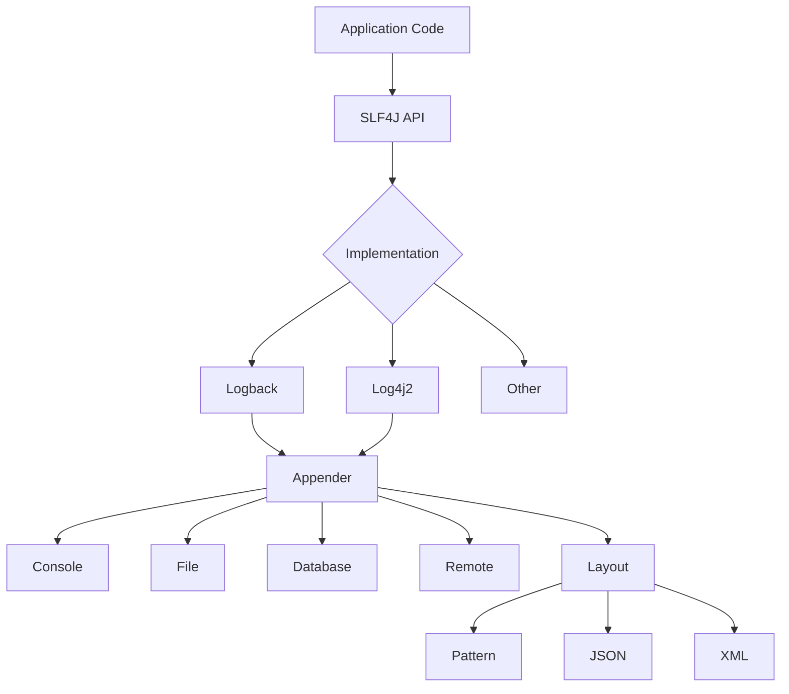
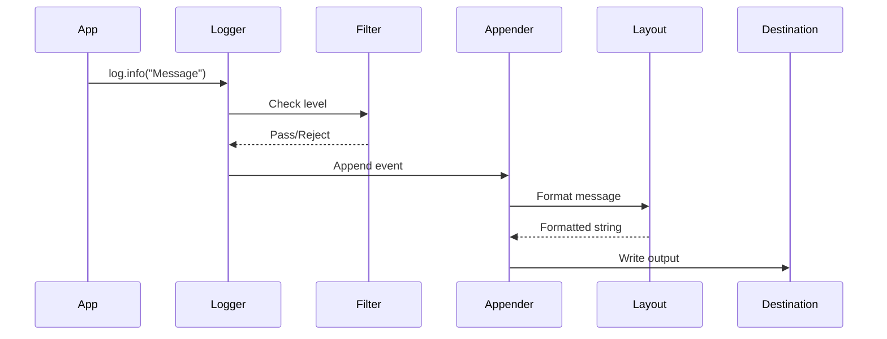

# Module 27: Logging in Java

## Introduction
Logging is a critical aspect of software development that helps developers understand application behavior, debug issues, and monitor system health. This module covers comprehensive logging practices in Java using SLF4J, Logback, and Log4j2.

## Learning Objectives
- Understand the importance of logging in enterprise applications
- Master SLF4J as a logging facade
- Configure Logback and Log4j2 effectively
- Implement structured logging with MDC and markers
- Optimize logging for performance
- Apply best practices for production logging

## Prerequisites
- Basic Java knowledge
- Understanding of OOP concepts
- Familiarity with XML/JSON configuration

## Why This Concept Exists
Logging provides visibility into application behavior at runtime. Without proper logging, debugging production issues becomes nearly impossible. Logging enables:
- **Debugging**: Understanding what went wrong
- **Monitoring**: Tracking application health
- **Auditing**: Recording user actions and system changes
- **Performance Analysis**: Identifying bottlenecks
- **Security**: Detecting suspicious activities

## Problem Statement
Consider a banking application processing thousands of transactions daily. Without logging:
- How do you know which transactions succeeded or failed?
- How do you trace a customer's transaction history?
- How do you identify performance issues?
- How do you detect security breaches?

## Theory

### Logging Levels
```
TRACE < DEBUG < INFO < WARN < ERROR
```

| Level | Use Case | Production |
|-------|----------|------------|
| TRACE | Detailed debugging | No |
| DEBUG | Debug information | Conditional |
| INFO | General information | Yes |
| WARN | Warning messages | Yes |
| ERROR | Error conditions | Yes |

### SLF4J (Simple Logging Facade for Java)
- Provides a unified API for different logging implementations
- Allows easy switching between logging frameworks
- Uses parameterized messages for performance

### Logback
- Native implementation of SLF4J
- Faster than Log4j
- Automatic configuration reloading
- Advanced filtering capabilities

### Log4j2
- High-performance asynchronous logging
- Plugin architecture
- Advanced configuration options
- Better garbage collection behavior

## Internal Working

### Logging Pipeline
```
Application Code → Logger → Appender → Layout → Destination
                      ↓
               Filter (optional)
```

### MDC (Mapped Diagnostic Context)
- Thread-local storage for contextual data
- Automatic inclusion in log messages
- Useful for request tracing

### Markers
- Named tokens for categorizing log events
- Enable conditional logging
- Support filtering and routing

## JVM Perspective

### Memory Impact
- **String concatenation**: Creates temporary objects
- **Parameterized logging**: Only evaluates if log level enabled
- **Lazy evaluation**: Avoids unnecessary object creation

### Thread Safety
- Loggers are thread-safe
- MDC is thread-local
- Async appenders use lock-free data structures

## Memory Representation

### Log Event Object
```
LogEvent {
    timestamp: long
    level: LogLevel
    loggerName: String
    message: String
    threadName: String
    mdcData: Map<String, String>
    markers: List<Marker>
    throwable: Throwable
}
```

## Architecture Diagram



## Flow Diagram



## Syntax

### Basic Logging
```java
import org.slf4j.Logger;
import org.slf4j.LoggerFactory;

private static final Logger logger = LoggerFactory.getLogger(MyClass.class);

logger.info("Application started");
logger.debug("Processing item: {}", itemId);
logger.error("Failed to process request", exception);
```

### MDC Usage
```java
import org.slf4j.MDC;

MDC.put("userId", "12345");
MDC.put("requestId", UUID.randomUUID().toString());

try {
    logger.info("Processing request");  // Includes MDC values
} finally {
    MDC.clear();
}
```

### Markers
```java
import org.slf4j.Marker;
import org.slf4j.MarkerFactory;

Marker auditMarker = MarkerFactory.getMarker("AUDIT");
logger.info(auditMarker, "User logged in: {}", userId);
```

## Easy Example

```java
public class SimpleLogging {
    private static final Logger logger = LoggerFactory.getLogger(SimpleLogging.class);
    
    public static void main(String[] args) {
        logger.trace("Trace message");
        logger.debug("Debug message");
        logger.info("Info message");
        logger.warn("Warning message");
        logger.error("Error message");
    }
}
```

## Medium Example

```java
public class UserService {
    private static final Logger logger = LoggerFactory.getLogger(UserService.class);
    
    public User createUser(CreateUserRequest request) {
        logger.info("Creating user with email: {}", request.getEmail());
        
        try {
            User user = userRepository.save(request.toUser());
            logger.info("User created successfully with ID: {}", user.getId());
            return user;
        } catch (DuplicateKeyException e) {
            logger.warn("User already exists with email: {}", request.getEmail());
            throw new UserAlreadyExistsException(request.getEmail(), e);
        } catch (Exception e) {
            logger.error("Failed to create user with email: {}", request.getEmail(), e);
            throw new ServiceException("User creation failed", e);
        }
    }
}
```

## Hard Example

```java
@Service
public class OrderProcessingService {
    private static final Logger logger = LoggerFactory.getLogger(OrderProcessingService.class);
    private static final Logger auditLogger = LoggerFactory.getLogger("AUDIT");
    
    @Value("${logging.sensitive.mask:true}")
    private boolean maskSensitiveData;
    
    public OrderResult processOrder(Order order) {
        MDC.put("orderId", order.getId());
        MDC.put("customerId", order.getCustomerId());
        MDC.put("amount", String.valueOf(order.getTotalAmount()));
        
        Marker orderMarker = MarkerFactory.getMarker("ORDER");
        Marker paymentMarker = MarkerFactory.getMarker("PAYMENT");
        
        try {
            logger.info(orderMarker, "Processing order: {}", order.getId());
            
            validateOrder(order);
            logger.debug(orderMarker, "Order validation passed");
            
            PaymentResult payment = processPayment(order);
            if (payment.isSuccessful()) {
                logger.info(paymentMarker, "Payment processed: {}", payment.getTransactionId());
                auditLogger.info("Order {} completed for customer {} with amount {}", 
                    order.getId(), order.getCustomerId(), order.getTotalAmount());
                return OrderResult.success(order.getId(), payment.getTransactionId());
            } else {
                logger.warn(paymentMarker, "Payment failed: {}", payment.getFailureReason());
                return OrderResult.failed(order.getId(), payment.getFailureReason());
            }
        } catch (Exception e) {
            logger.error(orderMarker, "Order processing failed: {}", order.getId(), e);
            auditLogger.error("Order {} failed for customer {}: {}", 
                order.getId(), order.getCustomerId(), e.getMessage());
            throw new OrderProcessingException("Failed to process order: " + order.getId(), e);
        } finally {
            MDC.clear();
        }
    }
    
    private void validateOrder(Order order) {
        if (maskSensitiveData) {
            logger.debug("Validating order with masked data");
        } else {
            logger.debug("Validating order: {}", order);
        }
        // Validation logic
    }
}
```

## Enterprise Example

```java
@Configuration
@Slf4j
public class LoggingConfig {
    
    @Bean
    public RequestLoggingFilter requestLoggingFilter() {
        CommonsRequestLoggingFilter filter = new CommonsRequestLoggingFilter();
        filter.setIncludeClientInfo(true);
        filter.setIncludeQueryString(true);
        filter.setIncludePayload(true);
        filter.setMaxPayloadLength(10000);
        filter.setIncludeHeaders(true);
        filter.setAfterMessagePrefix("REQUEST DATA: ");
        return filter;
    }
    
    @ControllerAdvice
    public static class LoggingExceptionHandler {
        
        private static final Logger errorLogger = LoggerFactory.getLogger("ERROR HANDLER");
        
        @ExceptionHandler(Exception.class)
        @ResponseStatus(HttpStatus.INTERNAL_SERVER_ERROR)
        public ErrorResponse handleException(Exception ex, HttpServletRequest request) {
            MDC.put("requestURI", request.getRequestURI());
            MDC.put("method", request.getMethod());
            
            try {
                errorLogger.error("Unhandled exception: {}", ex.getMessage(), ex);
                
                return ErrorResponse.builder()
                    .timestamp(Instant.now())
                    .status(HttpStatus.INTERNAL_SERVER_ERROR.value())
                    .error("Internal Server Error")
                    .message(ex.getMessage())
                    .path(request.getRequestURI())
                    .build();
            } finally {
                MDC.clear();
            }
        }
    }
}
```

## Performance

### Comparison Table

| Operation | Time Complexity | Space Complexity | Notes |
|-----------|-----------------|------------------|-------|
| Enabled log check | O(1) | O(1) | Quick level check |
| Parameterized message | O(n) | O(n) | Only if enabled |
| String concatenation | O(n) | O(n) | Always evaluated |
| MDC put/get | O(1) | O(1) | Thread-local |
| Async logging | O(1) amortized | O(n) | Buffered |

### Best Practices for Performance

1. **Use parameterized messages**
   ```java
   // Good
   logger.debug("Processing item: {}", itemId);
   
   // Bad - always evaluated
   logger.debug("Processing item: " + itemId);
   ```

2. **Check log level before expensive operations**
   ```java
   if (logger.isDebugEnabled()) {
       logger.debug("Complex: {}", complexToString());
   }
   ```

3. **Use async appenders for I/O-heavy destinations**

4. **Avoid logging in tight loops**

## Time & Space Complexity

| Operation | Time | Space |
|-----------|------|-------|
| Log level check | O(1) | O(1) |
| Simple message | O(1) | O(1) |
| Parameterized message | O(m) | O(m) |
| Exception logging | O(s) | O(s) |
| MDC operations | O(1) | O(1) |

Where m = message length, s = stack trace size

## Thread Safety

- **Logger instances**: Thread-safe (immutable)
- **MDC**: Thread-local storage (thread-safe by design)
- **Async appenders**: Use lock-free data structures
- **Appenders**: Most are thread-safe, check documentation

## Best Practices

1. **Use SLF4J as the facade**
2. **Log meaningful messages**
3. **Include context (MDC) for request tracing**
4. **Use appropriate log levels**
5. **Mask sensitive data**
6. **Use structured logging (JSON)**
7. **Configure log rotation**
8. **Monitor log volume and performance**
9. **Use markers for categorization**
10. **Test logging configuration**

## Common Mistakes

1. **Using string concatenation**
2. **Logging sensitive data (passwords, PII)**
3. **Logging too much in production**
4. **Not using MDC for request tracing**
5. **Ignoring log level configuration**
6. **Not configuring log rotation**
7. **Using System.out.println**
8. **Logging in finally blocks without MDC.clear()**

## Pitfalls

1. **Performance impact in high-throughput systems**
2. **Log injection attacks**
3. **Disk space exhaustion**
4. **Circular logging dependencies**
5. **Thread context loss in async scenarios**

## Debugging Tips

1. **Enable DEBUG level temporarily**
2. **Use MDC to trace requests**
3. **Check log configuration files**
4. **Verify classpath for logging implementations**
5. **Use logging benchmarks**

## Decision Tree

```
What to log?
├── User actions → INFO with audit marker
├── System events → INFO
├── Debug information → DEBUG
├── Warnings → WARN
├── Errors → ERROR with exception
└── Sensitive data → Mask or omit
```

## Interview Questions

1. What is the difference between SLF4J and Logback?
2. How does MDC work and when would you use it?
3. Explain the performance implications of different logging approaches.
4. How would you implement request tracing in a microservices architecture?
5. What are the security considerations for logging?
6. How do you configure log rotation in production?
7. Explain the difference between synchronous and asynchronous logging.
8. How would you handle logging in a multi-threaded application?
9. What is the impact of logging on garbage collection?
10. How do you test logging in unit tests?
11. Explain marker usage in logging frameworks.
12. How would you implement audit logging?
13. What are the best practices for error logging?
14. How do you handle sensitive data in logs?
15. Explain log aggregation strategies.

## Exercises

### Level 1: Basic
1. Configure Logback with console and file appenders
2. Implement logging in a simple REST controller
3. Add MDC for request ID tracking

### Level 2: Intermediate
1. Create a custom log encoder for JSON formatting
2. Implement audit logging for user actions
3. Add log level configuration via REST endpoint

### Level 3: Advanced
1. Build a log aggregation system
2. Implement log-based alerting
3. Create a custom Appender for external logging service

## Summary
Logging is essential for monitoring, debugging, and auditing applications. Use SLF4J with Logback or Log4j2, implement structured logging with MDC and markers, and always consider performance and security implications.

## References
- SLF4J Documentation: http://www.slf4j.org/
- Logback Manual: http://logback.qos.ch/manual/
- Log4j2 Documentation: https://logging.apache.org/log4j/2.x/
- SLF4J MDC: http://www.slf4j.org/apidocs/org/slf4j/MDC.html