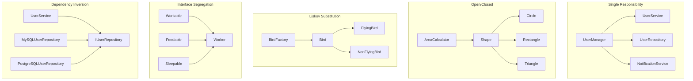
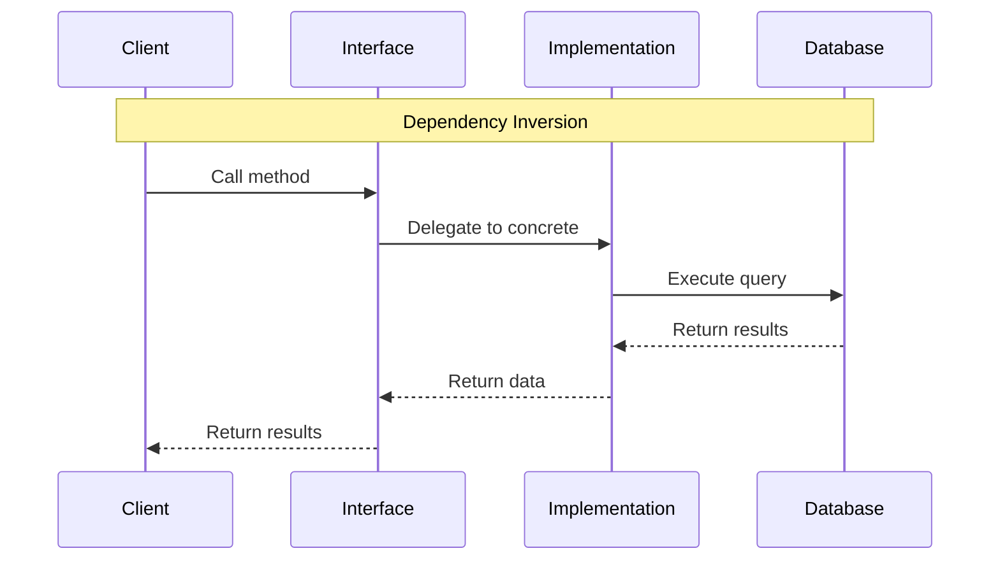

# Module 30: SOLID Principles

## Introduction
SOLID is an acronym representing five fundamental object-oriented design principles that help developers create maintainable, flexible, and robust software systems. These principles were introduced by Robert C. Martin (Uncle Bob) and form the foundation of clean architecture.

## Learning Objectives
- Understand each SOLID principle thoroughly
- Recognize code smells that violate these principles
- Apply SOLID principles to design better software
- Refactor code to follow SOLID principles
- Balance principles with practical considerations

## Prerequisites
- Basic Java knowledge
- Understanding of OOP concepts (inheritance, polymorphism)
- Familiarity with design patterns (helpful but not required)

## Why This Concept Exists
SOLID principles address common software design problems:
- **Rigidity**: Changes require many modifications
- **Fragility**: Changes break existing functionality
- **Immobility**: Code is difficult to reuse
- **Viscosity**: Easy to do wrong things, hard to do right

## Problem Statement
Consider a banking application that:
- Handles different account types (Savings, Checking, Investment)
- Processes various transactions (Deposits, Withdrawals, Transfers)
- Needs to generate reports for different departments
- Must evolve to support new account types and regulations

Without SOLID principles, this application would become:
- Difficult to extend with new account types
- Prone to bugs when modifying existing code
- Hard to test and maintain
- Full of duplicated code

## Theory

### S - Single Responsibility Principle (SRP)
> A class should have only one reason to change.

Each class should have a single, well-defined responsibility.

### O - Open/Closed Principle (OCP)
> Software entities should be open for extension but closed for modification.

New functionality should be added by extending existing code, not modifying it.

### L - Liskov Substitution Principle (LSP)
> Objects of a superclass should be replaceable with objects of its subclasses without breaking the application.

Subtypes must be substitutable for their base types.

### I - Interface Segregation Principle (ISP)
> No client should be forced to depend on methods it does not use.

Create specific interfaces rather than general-purpose ones.

### D - Dependency Inversion Principle (DIP)
> High-level modules should not depend on low-level modules. Both should depend on abstractions.

Depend on abstractions, not concrete implementations.

## Internal Working

### Principle Relationships
```
SRP → Single responsibility
  ↓
OCP → Extension without modification
  ↓
LSP → Substitutability
  ↓
ISP → Interface specificity
  ↓
DIP → Abstraction dependency
```

### Design Benefits
- **Testability**: Easier to mock dependencies
- **Maintainability**: Changes localized to specific modules
- **Flexibility**: Easy to extend with new functionality
- **Reusability**: Components can be reused in different contexts

## JVM Perspective

### Bytecode Impact
- **Inheritance**: Virtual method calls (slightly slower)
- **Interface implementation**: Similar performance to inheritance
- **Polymorphism**: JIT compiler optimizes with devirtualization
- **Memory**: Additional overhead for interface dispatch tables

### Performance Considerations
- **Method inlining**: HotSpot can inline virtual methods
- **Class hierarchy**: Affects memory layout
- **Interface default methods**: Java 8+ feature, adds flexibility

## Memory Representation

### Object Layout
```
Object Header (12-16 bytes)
  - Mark word (8 bytes)
  - Klass pointer (4 bytes)
Padding (0-4 bytes)
Instance fields
  - Reference types (4 bytes each)
  - Primitive types (varies)
```

### Interface Dispatch
```
Interface method call:
  1. Look up in vtable/interface table
  2. Jump to implementation
  3. JIT may optimize with monomorphic/bimorphic inlining
```

## Architecture Diagram



## Flow Diagram



## Syntax

### Single Responsibility
```java
// Bad: Multiple responsibilities
class UserManager {
    void createUser(User user) { }
    void sendEmail(User user) { }
    void generateReport(User user) { }
}

// Good: Single responsibility
class UserService {
    void createUser(User user) { }
}
class EmailService {
    void sendEmail(User user) { }
}
class ReportService {
    void generateReport(User user) { }
}
```

### Open/Closed
```java
// Bad: Requires modification for new types
class AreaCalculator {
    double calculate(Object shape) {
        if (shape instanceof Circle) {
            return Math.PI * ((Circle) shape).radius * ((Circle) shape).radius;
        } else if (shape instanceof Rectangle) {
            return ((Rectangle) shape).width * ((Rectangle) shape).height;
        }
        return 0;
    }
}

// Good: Open for extension
interface Shape {
    double area();
}
class Circle implements Shape {
    double radius;
    public double area() { return Math.PI * radius * radius; }
}
class Rectangle implements Shape {
    double width, height;
    public double area() { return width * height; }
}
class AreaCalculator {
    double calculate(Shape shape) {
        return shape.area();
    }
}
```

## Easy Example

```java
// Single Responsibility
class User {
    private String name;
    private String email;
    
    // Getters and setters
}

class UserService {
    private UserRepository repository;
    
    void createUser(User user) {
        repository.save(user);
    }
}

class EmailService {
    void sendWelcomeEmail(User user) {
        // Send email logic
    }
}
```

## Medium Example

```java
// Open/Closed Principle
interface PaymentProcessor {
    PaymentResult process(PaymentRequest request);
}

class CreditCardProcessor implements PaymentProcessor {
    public PaymentResult process(PaymentRequest request) {
        // Credit card processing logic
        return new PaymentResult(true, "CC-" + System.currentTimeMillis());
    }
}

class PayPalProcessor implements PaymentProcessor {
    public PaymentResult process(PaymentRequest request) {
        // PayPal processing logic
        return new PaymentResult(true, "PP-" + System.currentTimeMillis());
    }
}

class BankTransferProcessor implements PaymentProcessor {
    public PaymentResult process(PaymentRequest request) {
        // Bank transfer logic
        return new PaymentResult(true, "BT-" + System.currentTimeMillis());
    }
}

class PaymentService {
    private Map<String, PaymentProcessor> processors;
    
    PaymentResult processPayment(String type, PaymentRequest request) {
        PaymentProcessor processor = processors.get(type);
        if (processor == null) {
            throw new IllegalArgumentException("Unknown payment type: " + type);
        }
        return processor.process(request);
    }
}
```

## Hard Example

```java
// Interface Segregation Principle
interface Workable {
    void work();
}

interface Feedable {
    void feed();
}

interface Sleepable {
    void sleep();
}

interface Manageable {
    void manage();
}

// Robots implement only what they need
class WorkerRobot implements Workable {
    public void work() {
        // Robot working
    }
}

class HumanWorker implements Workable, Feedable, Sleepable {
    public void work() {
        // Human working
    }
    
    public void feed() {
        // Human eating
    }
    
    public void sleep() {
        // Human sleeping
    }
}

class Manager implements Workable, Feedable, Sleepable, Manageable {
    public void work() {
        // Manager working
    }
    
    public void feed() {
        // Manager eating
    }
    
    public void sleep() {
        // Manager sleeping
    }
    
    public void manage() {
        // Manager managing
    }
}

// Dependency Inversion
interface UserRepository {
    void save(User user);
    User findById(String id);
}

interface EmailService {
    void sendEmail(String to, String subject, String body);
}

class MySQLUserRepository implements UserRepository {
    public void save(User user) {
        // MySQL implementation
    }
    
    public User findById(String id) {
        // MySQL implementation
        return new User();
    }
}

class PostgresUserRepository implements UserRepository {
    public void save(User user) {
        // PostgreSQL implementation
    }
    
    public User findById(String id) {
        // PostgreSQL implementation
        return new User();
    }
}

class SmtpEmailService implements EmailService {
    public void sendEmail(String to, String subject, String body) {
        // SMTP implementation
    }
}

class UserRegistrationService {
    private final UserRepository userRepository;
    private final EmailService emailService;
    
    // Constructor injection
    UserRegistrationService(UserRepository userRepository, EmailService emailService) {
        this.userRepository = userRepository;
        this.emailService = emailService;
    }
    
    void registerUser(String name, String email) {
        User user = new User(name, email);
        userRepository.save(user);
        emailService.sendEmail(email, "Welcome!", "Welcome to our platform!");
    }
}
```

## Enterprise Example

```java
// Full SOLID implementation in enterprise scenario

// SRP: Each class has single responsibility
class OrderValidator {
    ValidationResult validate(Order order) {
        // Validation logic
        return ValidationResult.success();
    }
}

class OrderPricingCalculator {
    Money calculateTotal(Order order) {
        // Pricing logic
        return Money.ZERO;
    }
}

class OrderPersistenceService {
    void save(Order order) {
        // Persistence logic
    }
}

class OrderNotificationService {
    void notifyOrderPlaced(Order order) {
        // Notification logic
    }
}

// OCP: New order types can be added without modification
interface OrderProcessor {
    boolean canProcess(OrderType type);
    ProcessResult process(Order order);
}

class RegularOrderProcessor implements OrderProcessor {
    public boolean canProcess(OrderType type) {
        return type == OrderType.REGULAR;
    }
    
    public ProcessResult process(Order order) {
        // Regular order processing
        return ProcessResult.success();
    }
}

class ExpressOrderProcessor implements OrderProcessor {
    public boolean canProcess(OrderType type) {
        return type == OrderType.EXPRESS;
    }
    
    public ProcessResult process(Order order) {
        // Express order processing with priority
        return ProcessResult.success();
    }
}

class BulkOrderProcessor implements OrderProcessor {
    public boolean canProcess(OrderType type) {
        return type == OrderType.BULK;
    }
    
    public ProcessResult process(Order order) {
        // Bulk order processing with discounts
        return ProcessResult.success();
    }
}

// LSP: All order processors are interchangeable
class OrderProcessingPipeline {
    private final List<OrderProcessor> processors;
    
    ProcessResult processOrder(Order order) {
        for (OrderProcessor processor : processors) {
            if (processor.canProcess(order.getType())) {
                return processor.process(order);
            }
        }
        throw new UnsupportedOrderTypeException(order.getType());
    }
}

// ISP: Specific interfaces for different concerns
interface OrderValidatorInterface {
    ValidationResult validate(Order order);
}

interface OrderPricerInterface {
    Money calculatePrice(Order order);
}

interface OrderPersisterInterface {
    void save(Order order);
}

// DIP: High-level modules depend on abstractions
class OrderService {
    private final OrderValidatorInterface validator;
    private final OrderPricerInterface pricer;
    private final OrderPersisterInterface persister;
    private final OrderProcessor processor;
    private final NotificationService notificationService;
    
    OrderService(OrderValidatorInterface validator,
                 OrderPricerInterface pricer,
                 OrderPersisterInterface persister,
                 OrderProcessor processor,
                 NotificationService notificationService) {
        this.validator = validator;
        this.pricer = pricer;
        this.persister = persister;
        this.processor = processor;
        this.notificationService = notificationService;
    }
    
    OrderResult placeOrder(Order order) {
        ValidationResult validation = validator.validate(order);
        if (!validation.isValid()) {
            return OrderResult.failed(validation.getErrors());
        }
        
        Money total = pricer.calculatePrice(order);
        order.setTotalAmount(total);
        
        ProcessResult result = processor.process(order);
        if (!result.isSuccess()) {
            return OrderResult.failed(result.getErrors());
        }
        
        persister.save(order);
        notificationService.notifyOrderPlaced(order);
        
        return OrderResult.success(order.getId());
    }
}
```

## Performance

| Principle | Impact | Trade-off |
|-----------|--------|-----------|
| SRP | Minimal | More classes to manage |
| OCP | Minimal | More abstraction layers |
| LSP | Minimal | Careful inheritance design |
| ISP | Minimal | More interfaces |
| DIP | Minimal | More indirection |

## Time & Space Complexity

| Operation | Without SOLID | With SOLID |
|-----------|---------------|------------|
| Add new feature | O(n) modifications | O(1) extensions |
| Fix bug | High risk, many changes | Low risk, isolated |
| Test | Difficult to mock | Easy to mock |
| Understand | Monolithic, complex | Modular, clear |

## Thread Safety

- **SRP**: Reduces shared state complexity
- **OCP**: Immutable designs easier to make thread-safe
- **LSP**: Subtypes must maintain thread-safety contracts
- **ISP**: Smaller interfaces reduce synchronization needs
- **DIP**: Abstractions can hide thread-safety implementations

## Best Practices

1. **Start with SRP**: Easiest to apply and most impactful
2. **Use composition over inheritance**: Supports OCP and LSP
3. **Program to interfaces**: Supports ISP and DIP
4. **Apply principles gradually**: Don't over-engineer
5. **Consider context**: Not every application needs all principles
6. **Write tests**: Verify principle compliance
7. **Refactor regularly**: Keep code clean
8. **Document exceptions**: When principles can't be fully applied

## Common Mistakes

1. **Over-application**: Creating too many small classes
2. **Premature abstraction**: Abstracting before requirements are clear
3. **Violating LSP**: Subclasses changing parent behavior
4. **Fat interfaces**: Including too many methods
5. **Concrete dependencies**: Depending on implementations, not abstractions
6. **Ignoring context**: Applying principles where inappropriate

## Pitfalls

1. **Performance overhead**: Extra indirection layers
2. **Complexity increase**: More classes and interfaces
3. **Learning curve**: Team needs training
4. **Over-engineering**: Solving problems that don't exist

## Debugging Tips

1. **Check LSP violations**: Test subclass substitution
2. **Identify SRP violations**: Look for classes with multiple reasons to change
3. **Find ISP violations**: Look for classes implementing unused methods
4. **Spot DIP violations**: Look for concrete class dependencies

## Comparison Table

| Principle | Focus | Benefit | Cost |
|-----------|-------|---------|------|
| SRP | Class responsibility | Easier maintenance | More classes |
| OCP | Extension | Easy to extend | More abstraction |
| LSP | Substitution | Reliable inheritance | Careful design |
| ISP | Interface size | Reduced coupling | More interfaces |
| DIP | Dependency direction | Flexibility | More indirection |

## Decision Tree

```
Should I create a new class?
├── Does the class have multiple responsibilities? → Yes → Split (SRP)
├── Will I need to add new types? → Yes → Use abstraction (OCP)
├── Will subclasses change behavior? → Yes → Redesign (LSP)
├── Does interface have unused methods? → Yes → Split (ISP)
└── Do I depend on concrete classes? → Yes → Use interfaces (DIP)
```

## Interview Questions

1. Explain each SOLID principle with real-world examples.
2. How does SOLID relate to clean code?
3. Can SOLID principles conflict with each other?
4. How do you apply SOLID in legacy code?
5. What are the trade-offs of applying SOLID principles?
6. How do SOLID principles affect testing?
7. Explain the relationship between SOLID and design patterns.
8. How do you refactor code to follow SOLID principles?
9. What are the consequences of violating SOLID principles?
10. How do SOLID principles apply to microservices architecture?
11. Can you give an example of SOLID in Java standard library?
12. How do SOLID principles affect performance?
13. What are the alternatives to SOLID principles?
14. How do you convince a team to adopt SOLID principles?
15. What are the limitations of SOLID principles?

## Exercises

### Level 1: Basic
1. Identify SOLID violations in given code
2. Refactor a class to follow SRP
3. Create an interface hierarchy following ISP

### Level 2: Intermediate
1. Design a payment system following all SOLID principles
2. Refactor a legacy class to follow OCP
3. Create a test suite that verifies LSP compliance

### Level 3: Advanced
1. Design an e-commerce system architecture with SOLID
2. Create a plugin system using OCP and DIP
3. Refactor a large codebase to follow SOLID principles

## Summary
SOLID principles are fundamental to good software design. They help create maintainable, flexible, and testable code. Apply them pragmatically, considering the specific context and requirements of your project.

## References
- "Clean Code" by Robert C. Martin
- "Agile Software Development: Principles, Patterns, and Practices"
- SOLID Principles Explained: https://stackify.com/solid-design-principles/
- Refactoring Guru: https://refactoring.guru/design-principles