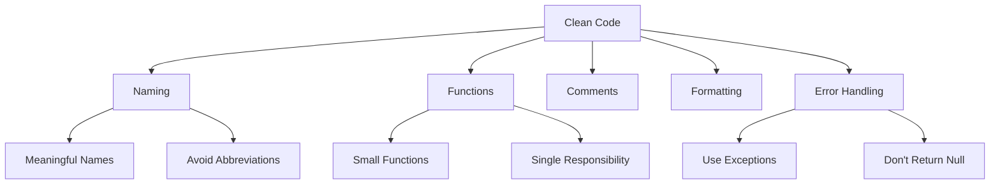
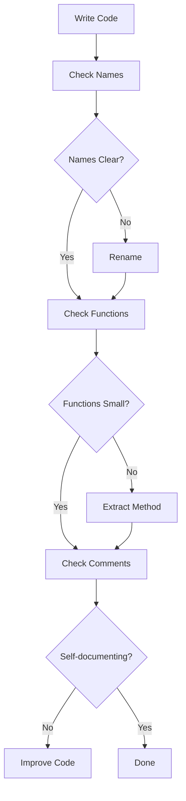
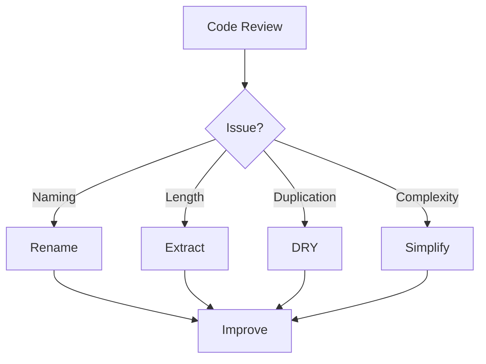

# Module 31: Clean Code

## Overview
Clean Code is a software engineering philosophy focused on writing readable, maintainable, and efficient code. It emphasizes naming conventions, function design, error handling, and code organization.

## Learning Objectives
- Master naming conventions
- Understand function design
- Apply code organization principles
- Implement error handling
- Write self-documenting code

## Prerequisites
- Basic Java knowledge
- Programming experience
- Code review exposure

## Why This Concept Exists
Bad code leads to:
- Bugs and defects
- Maintenance nightmares
- Technical debt
- Team friction
- Business losses

Clean code provides:
- Readability
- Maintainability
- Testability
- Team productivity
- Quality

## Problem Statement
How do you write code that is easy to read, understand, and maintain?

## Theory

### Clean Code Principles

| Principle | Description |
|-----------|-------------|
| Meaningful Names | Self-documenting identifiers |
| Small Functions | Single responsibility |
| DRY | Don't Repeat Yourself |
| KISS | Keep It Simple |
| YAGNI | You Aren't Gonna Need It |

### Naming Rules

| Type | Convention |
|------|-----------|
| Variables | camelCase |
| Methods | camelCase |
| Classes | PascalCase |
| Constants | UPPER_SNAKE |
| Packages | lowercase |

## Internal Working

### Code Smells

| Smell | Problem |
|-------|---------|
| Long Method | Too many responsibilities |
| Large Class | Too many fields/methods |
| Duplicated Code | Violates DRY |
| Long Parameter List | Too many dependencies |
| Feature Envy | Wrong class responsibility |

### Refactoring Patterns

| Pattern | Purpose |
|---------|---------|
| Extract Method | Break large methods |
| Extract Class | Break large classes |
| Rename | Improve naming |
| Inline | Remove unnecessary |
| Move Method | Correct responsibility |

## JVM Perspective

### Code Quality Tools
- Checkstyle: style checking
- PMD: static analysis
- SpotBugs: bug detection
- SonarQube: quality gates

### Metrics
- Cyclomatic Complexity
- Lines of Code
- Code Coverage
- Technical Debt

## Memory Representation
```
Clean Code Structure:
┌─────────────────────────────────────┐
│ Class: Well-named, focused          │
│  ├─ Fields: Private, minimal        │
│  ├─ Constructor: Clear setup        │
│  ├─ Methods: Small, single purpose  │
│  └─ Inner classes: If needed        │
└─────────────────────────────────────┘
```

## Architecture Diagram



## Flow Diagram



## Syntax

### Bad Code
```java
// Bad naming
int d; // elapsed time in days
List<String> l; // list of strings

// Long method
public void process(List<Order> orders) {
    // 100+ lines of code
    // Multiple responsibilities
    // Hard to understand
}
```

### Good Code
```java
// Good naming
int elapsedTimeInDays;
List<String> customerNames;

// Small, focused methods
public void processOrders(List<Order> orders) {
    List<Order> validOrders = filterValidOrders(orders);
    calculateTotals(validOrders);
    saveOrders(validOrders);
}

private List<Order> filterValidOrders(List<Order> orders) {
    return orders.stream()
        .filter(this::isValidOrder)
        .collect(Collectors.toList());
}

private boolean isValidOrder(Order order) {
    return order.getAmount() > 0 && order.getCustomer() != null;
}
```

## Easy Example
```java
// Before
public class Calculator {
    public int calc(int a, int b, int c) {
        return a + b * c;
    }
}

// After
public class PriceCalculator {
    private static final double TAX_RATE = 0.15;
    
    public double calculateTotalPrice(
            double basePrice, 
            double quantity, 
            double discountRate) {
        double subtotal = basePrice * quantity;
        double discount = subtotal * discountRate;
        double tax = (subtotal - discount) * TAX_RATE;
        return subtotal - discount + tax;
    }
}
```

## Medium Example
```java
// Before
public class UserManager {
    public void process(List<User> users, int type) {
        for (User u : users) {
            if (type == 1) {
                u.setStatus("active");
                u.setUpdatedAt(LocalDateTime.now());
            } else if (type == 2) {
                u.setStatus("inactive");
                u.setUpdatedAt(LocalDateTime.now());
            }
            // More if-else blocks...
        }
    }
}

// After
public class UserManager {
    private final UserStatusUpdater statusUpdater;
    
    public UserManager(UserStatusUpdater statusUpdater) {
        this.statusUpdater = statusUpdater;
    }
    
    public void activateUsers(List<User> users) {
        users.forEach(statusUpdater::activate);
    }
    
    public void deactivateUsers(List<User> users) {
        users.forEach(statusUpdater::deactivate);
    }
}

public class UserStatusUpdater {
    public void activate(User user) {
        updateStatus(user, UserStatus.ACTIVE);
    }
    
    public void deactivate(User user) {
        updateStatus(user, UserStatus.INACTIVE);
    }
    
    private void updateStatus(User user, UserStatus status) {
        user.setStatus(status);
        user.setUpdatedAt(LocalDateTime.now());
    }
}
```

## Hard Example
```java
// Before - God class
public class OrderService {
    private OrderRepository orderRepo;
    private UserRepository userRepo;
    private PaymentService paymentService;
    private EmailService emailService;
    private InventoryService inventoryService;
    
    public void processOrder(Order order) {
        // 200+ lines mixing concerns
        // Validation, payment, email, inventory...
    }
}

// After - Single Responsibility
public class OrderService {
    private final OrderValidator validator;
    private final OrderProcessor processor;
    private final OrderNotifier notifier;
    
    public OrderService(
            OrderValidator validator,
            OrderProcessor processor,
            OrderNotifier notifier) {
        this.validator = validator;
        this.processor = processor;
        this.notifier = notifier;
    }
    
    public OrderResult processOrder(Order order) {
        ValidationResult validation = validator.validate(order);
        if (!validation.isValid()) {
            return OrderResult.failure(validation.getErrors());
        }
        
        OrderResult result = processor.process(order);
        if (result.isSuccess()) {
            notifier.notifyOrderProcessed(order);
        }
        
        return result;
    }
}

public class OrderValidator {
    public ValidationResult validate(Order order) {
        List<String> errors = new ArrayList<>();
        
        if (order.getItems().isEmpty()) {
            errors.add("Order must have at least one item");
        }
        if (order.getTotal() <= 0) {
            errors.add("Order total must be positive");
        }
        
        return new ValidationResult(errors.isEmpty(), errors);
    }
}

public class OrderProcessor {
    private final PaymentService paymentService;
    private final InventoryService inventoryService;
    
    public OrderResult process(Order order) {
        try {
            processPayment(order);
            updateInventory(order);
            return OrderResult.success(order);
        } catch (PaymentException e) {
            return OrderResult.failure("Payment failed: " + e.getMessage());
        }
    }
}
```

## Enterprise Example
```java
// Clean architecture example
public interface OrderUseCase {
    OrderResult execute(OrderCommand command);
}

public class CreateOrderUseCase implements OrderUseCase {
    private final OrderRepository orderRepository;
    private final CustomerRepository customerRepository;
    private final OrderValidator validator;
    private final OrderMapper mapper;
    
    @Override
    public OrderResult execute(OrderCommand command) {
        return validator.validate(command)
            .map(this::createOrder)
            .map(orderRepository::save)
            .map(order -> OrderResult.success(order.getId()))
            .orElseGet(() -> OrderResult.failure("Validation failed"));
    }
    
    private Order createOrder(OrderCommand command) {
        Customer customer = customerRepository.findById(command.getCustomerId())
            .orElseThrow(() -> new CustomerNotFoundException(command.getCustomerId()));
        
        return mapper.toOrder(command, customer);
    }
}

public record OrderCommand(
    Long customerId,
    List<OrderItemCommand> items,
    String shippingAddress
) {}

public record OrderResult(
    boolean success,
    Long orderId,
    List<String> errors
) {
    public static OrderResult success(Long orderId) {
        return new OrderResult(true, orderId, List.of());
    }
    
    public static OrderResult failure(String error) {
        return new OrderResult(false, null, List.of(error));
    }
}
```

## Performance Considerations
- Clean code doesn't mean slow code
- Premature optimization is root of all evil
- Profile before optimizing
- Readability first, optimize second

## Time & Space Complexity
| Metric | Bad Code | Clean Code |
|--------|----------|------------|
| Reading | O(n²) | O(n) |
| Modifying | O(n) | O(1) |
| Debugging | O(n³) | O(n) |
| Testing | O(n²) | O(n) |

## Thread Safety
- Immutable objects are thread-safe
- Clear ownership of resources
- Minimal shared state
- Explicit synchronization

## Best Practices
1. Name things clearly
2. Keep functions small
3. Single responsibility
4. Don't repeat yourself
5. Write self-documenting code

## Common Mistakes
1. Clever code over clear code
2. Too many comments
3. Deep nesting
4. Long parameter lists

## Pitfalls & Warnings
1. Over-engineering
2. Premature abstraction
3. Premature optimization
4. Following rules blindly

## Debugging Tips
1. Add meaningful logging
2. Use assertions
3. Write testable code
4. Keep debug code out

## Comparison Table

| Aspect | Bad Code | Clean Code |
|--------|----------|------------|
| Readability | Low | High |
| Maintainability | Hard | Easy |
| Testability | Difficult | Simple |
| Team Velocity | Slow | Fast |

## Decision Tree



## Interview Questions

### Q1: What is clean code?
**Answer:** Code that is easy to read, understand, and maintain.

### Q2: What are the principles of clean code?
**Answer:** Meaningful names, small functions, single responsibility, DRY, KISS.

### Q3: What is a code smell?
**Answer:** Indicators of potential problems in code structure.

### Q4: What is refactoring?
**Answer:** Improving code structure without changing behavior.

### Q5: What is the Single Responsibility Principle?
**Answer:** A class should have only one reason to change.

### Q6: What is DRY?
**Answer:** Don't Repeat Yourself - avoid code duplication.

### Q7: What is KISS?
**Answer:** Keep It Simple, Stupid - prefer simple solutions.

### Q8: What is YAGNI?
**Answer:** You Aren't Gonna Need It - don't add unused features.

### Q9: How do you write good names?
**Answer:** Use descriptive, intention-revealing names without abbreviations.

### Q10: What is the ideal function length?
**Answer:** As short as possible, ideally 5-20 lines.

### Q11: What is cyclomatic complexity?
**Answer:** Measure of code complexity based on control flow.

### Q12: What are code reviews?
**Answer:** Peer review of code for quality and knowledge sharing.

### Q13: What is technical debt?
**Answer:** Cost of future rework due to quick fixes today.

### Q14: What is the boy scout rule?
**Answer:** Leave the code cleaner than you found it.

### Q15: How do you balance clean code with deadlines?
**Answer:** Write clean code always - it saves time in long run.

## Exercises

### Easy
1. Refactor a long method
2. Improve variable names
3. Remove code duplication

### Medium
1. Apply SOLID principles
2. Refactor a god class
3. Write self-documenting code

### Hard
1. Refactor legacy system
2. Apply domain-driven design
3. Build maintainable architecture

## Summary
Clean code is essential for software quality. Focus on readability, simplicity, and maintainability.

## References
- Clean Code by Robert C. Martin
- Refactoring by Martin Fowler
- Effective Java by Joshua Bloch
