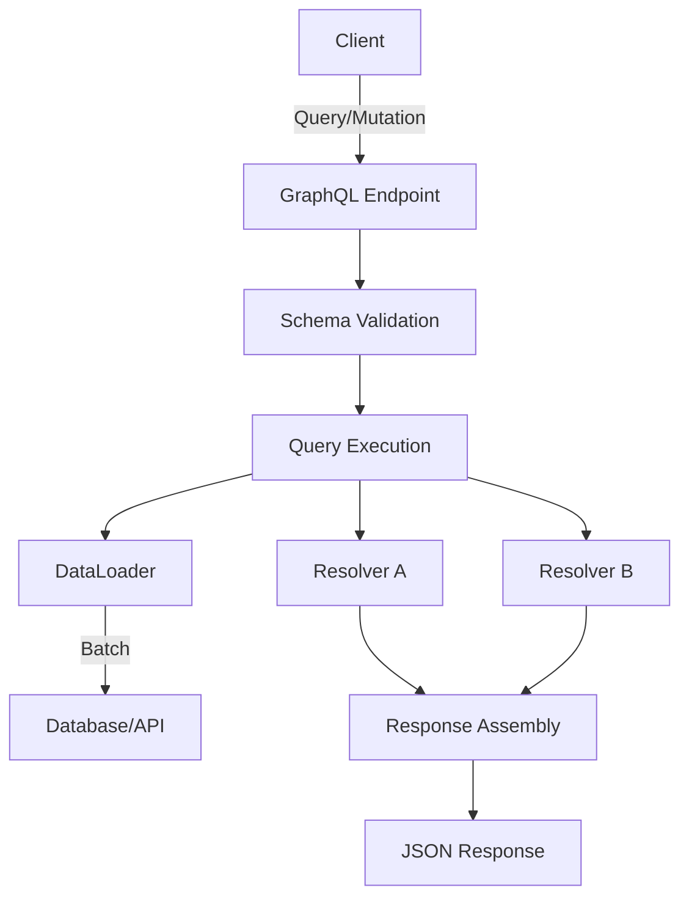
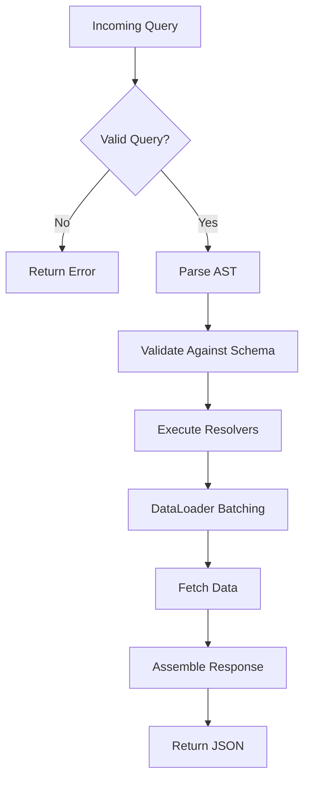

# Module 39: GraphQL

## 1. Introduction
GraphQL is a query language for APIs and a runtime for fulfilling those queries with your existing data. Developed by Facebook in 2012 and open-sourced in 2015, it provides a complete and understandable description of the data in your API, giving clients the power to ask for exactly what they needs.

## 2. Learning Objectives
- Understand GraphQL schema definition language
- Implement queries, mutations, and subscriptions
- Build resolvers for data fetching
- Use DataLoader to solve N+1 problem
- Integrate GraphQL with Spring Boot

## 3. Prerequisites
- Java 17+
- Spring Boot 3.x
- Understanding of REST APIs
- Maven/Gradle build tool

## 4. Why This Concept Exists
REST APIs suffer from over-fetching and under-fetching. GraphQL solves this by allowing clients to request exactly the data they need in a single request, reducing network overhead and improving performance.

## 5. Problem Statement
Building flexible APIs that serve multiple client types (web, mobile, IoT) without creating multiple endpoints or returning unnecessary data.

## 6. Theory
GraphQL uses a type system to define APIs. Clients specify exactly what data they want, and the server returns precisely that data. It uses a single endpoint and supports real-time data via subscriptions.

## 7. Internal Working
1. Client sends a query/mutation to the GraphQL endpoint
2. Server parses the query against the schema
3. Resolvers execute and fetch data
4. Response is shaped exactly as requested

## 8. JVM Perspective
GraphQL Java uses parsing trees and execution strategies. The schema is compiled into an object graph. Resolvers run in the request thread pool, with DataLoader batching calls.

## 9. Memory Representation
```
Schema (Type Registry)
├── Object Types -> Field Definitions
├── Input Types -> Argument Definitions
├── Enums -> Value Collections
└── Resolvers -> Method References
```

## 10. Architecture Diagram


## 11. Flow Diagram


## 12. Syntax

```graphql
# Schema Definition
type User {
  id: ID!
  name: String!
  email: String!
  posts: [Post!]
}

type Post {
  id: ID!
  title: String!
  content: String!
  author: User!
}

type Query {
  user(id: ID!): User
  users: [User!]!
}

type Mutation {
  createUser(name: String!, email: String!): User!
  updateUser(id: ID!, name: String, email: String): User!
  deleteUser(id: ID!): Boolean!
}

type Subscription {
  userCreated: User!
}
```

## 13. Easy Example

```java
@SpringBootApplication
public class GraphQLDemo {
    public static void main(String[] args) {
        SpringApplication.run(GraphQLDemo.class, args);
    }
}

@Component
public class UserQuery implements GraphQLQueryResolver {
    @Autowired
    private UserRepository userRepository;

    public User user(String id) {
        return userRepository.findById(id).orElse(null);
    }

    public List<User> users() {
        return userRepository.findAll();
    }
}
```

## 14. Medium Example

```java
@Component
public class PostResolver implements GraphQLResolver<User> {
    @Autowired
    private PostRepository postRepository;

    public List<Post> posts(User user) {
        return postRepository.findByAuthorId(user.getId());
    }
}

@Component
public class UserMutation implements GraphQLMutationResolver {
    @Autowired
    private UserRepository userRepository;

    public User createUser(String name, String email) {
        User user = new User(name, email);
        return userRepository.save(user);
    }

    public User updateUser(String id, String name, String email) {
        User user = userRepository.findById(id)
            .orElseThrow(() -> new RuntimeException("User not found"));
        if (name != null) user.setName(name);
        if (email != null) user.setEmail(email);
        return userRepository.save(user);
    }

    public boolean deleteUser(String id) {
        userRepository.deleteById(id);
        return true;
    }
}
```

## 15. Hard Example

```java
@Component
public class DataLoaderConfig {
    @Bean
    public BatchLoaderRegistry batchLoaderRegistry() {
        return new BatchLoaderRegistry() {
            @Override
            public void register(String key, BatchLoader<Object, Object> batchLoader) {
                // Configure batching
            }
        };
    }
}

@Component
public class UserWithPostsResolver implements GraphQLResolver<User> {
    @Autowired
    private DataLoaderRegistry dataLoaderRegistry;

    public CompletableFuture<List<Post>> posts(User user, DataFetchingEnvironment env) {
        DataLoader<String, List<Post>> loader = env.getDataLoader("postsLoader");
        return loader.load(user.getId());
    }
}

@DgsComponent
public class UserDataLoader {
    @DgsDataLoader(name = "postsLoader")
    public BatchLoader<String, Post> postsLoader() {
        return postIds -> {
            Map<String, List<Post>> postsByUserId = postRepository
                .findByAuthorIdIn(postIds)
                .stream()
                .collect(Collectors.groupingBy(Post::getAuthorId));
            return postIds.stream()
                .map(postsByUserId::get)
                .map(list -> list != null ? list : List.of())
                .collect(Collectors.toList());
        };
    }
}
```

## 16. Enterprise Example

```java
@Service
@Transactional
public class OrderGraphQLService {
    @Autowired private OrderRepository orderRepository;
    @Autowired private ProductRepository productRepository;
    @Autowired private UserRepository userRepository;

    public Order createOrder(CreateOrderInput input) {
        User user = userRepository.findById(input.getUserId())
            .orElseThrow(() -> new EntityNotFoundException("User not found"));

        Order order = new Order(user, input.getItems().stream()
            .map(item -> {
                Product product = productRepository.findById(item.getProductId())
                    .orElseThrow(() -> new EntityNotFoundException("Product not found"));
                return new OrderItem(product, item.getQuantity());
            })
            .collect(Collectors.toList()));

        return orderRepository.save(order);
    }

    public List<Order> ordersByStatus(OrderStatus status, int page, int size) {
        return orderRepository.findByStatus(status,
            PageRequest.of(page, size, Sort.by("createdAt").descending()));
    }

    @PreAuthorize("hasRole('ADMIN') or #userId == authentication.principal.id")
    public Order cancelOrder(String orderId, String userId) {
        Order order = orderRepository.findById(orderId)
            .orElseThrow(() -> new EntityNotFoundException("Order not found"));
        order.setStatus(OrderStatus.CANCELLED);
        return orderRepository.save(order);
    }
}
```

## 17. Performance
- **Query Complexity Analysis**: Limit depth and complexity
- **Persisted Queries**: Cache compiled queries
- **DataLoader**: Batch and cache database calls
- **Response Caching**: Cache at resolver level

## 18. Time & Space Complexity
| Operation | Time | Space |
|-----------|------|-------|
| Query Parse | O(n) | O(n) |
| Schema Validation | O(n) | O(n) |
| Resolver Execution | O(n × m) | O(n + m) |
| DataLoader Batching | O(n/k) | O(n) |

## 19. Thread Safety
- Resolvers should be stateless
- Use Spring's request-scoped beans for per-request data
- DataLoader instances are request-scoped
- Use ConcurrentHashMap for thread-safe caching

## 20. Best Practices
- Use DataLoader for N+1 prevention
- Implement query complexity limits
- Use persisted queries in production
- Version your schema
- Use input types for mutations

## 21. Common Mistakes
- Exposing internal database models directly
- Not implementing DataLoader for nested queries
- Missing authorization checks in resolvers
- Overloading a single schema with too many types
- Not handling errors properly in responses

## 22. Pitfalls
- Over-fetching is solved but network latency remains
- Caching is harder than REST (use persisted queries)
- File uploads require multipart specification
- Subscriptions add complexity to infrastructure

## 23. Debugging Tips
- Use GraphiQL/Playground for query testing
- Enable query logging in Spring
- Check resolver execution with DataLoader batch logs
- Use `@DgsQueryLoggingInstrumentation` for tracing

## 24. Comparison Table

| Feature | GraphQL | REST | gRPC |
|---------|---------|------|------|
| Data Fetching | Client-driven | Server-driven | Client-driven |
| Endpoints | Single | Multiple | Multiple |
| Schema | Strongly typed | Optional (OpenAPI) | Strongly typed |
| Real-time | Subscriptions | SSE/WebSockets | Streaming |
| Caching | Complex | Simple (HTTP) | Complex |
| Learning Curve | Medium | Low | High |

## 25. Decision Tree

```
Need flexible API for multiple clients?
├── Yes → Use GraphQL
├── No → Simple CRUD?
│   ├── Yes → Use REST
│   └── No → Need streaming?
│       ├── Yes → Use gRPC
│       └── No → Consider REST
```

## 26. Interview Questions

1. **What is the N+1 problem in GraphQL and how do you solve it?**
   N+1 occurs when resolving a list causes individual queries for each item. Solve with DataLoader batching.

2. **How does GraphQL handle versioning?**
   Through schema evolution - deprecate fields, add new ones rather than creating v2 endpoints.

3. **Explain the difference between queries and mutations.**
   Queries are read-only, mutations are write operations with guaranteed sequential execution.

4. **What is a DataLoader?**
   A utility that batches and caches database calls within a single request to prevent N+1.

5. **How do you handle authentication in GraphQL?**
   Via context/headers, checked in resolvers or via Spring Security integration.

6. **Can GraphQL replace REST entirely?**
   In many cases yes, but REST is simpler for straightforward CRUD APIs.

7. **What are GraphQL subscriptions?**
   Real-time updates via WebSockets when data changes.

8. **How do you optimize GraphQL query performance?**
   Query complexity limits, persisted queries, DataLoader, response caching.

9. **What is schema-first vs code-first?**
   Schema-first: define SDL then implement. Code-first: generate schema from code annotations.

10. **How do you handle errors in GraphQL?**
    GraphQL errors are returned in the errors array with partial data in the data field.

11. **What are fragments in GraphQL?**
    Reusable groups of fields that can be included in queries to avoid duplication.

12. **How does GraphQL handle file uploads?**
    Through multipart request specification, typically with a library like graphql-upload.

13. **What is a Directive in GraphQL?**
    Annotations that modify execution behavior, e.g., @deprecated, @include, @skip.

14. **How do you implement pagination in GraphQL?**
    Using Connection pattern (Relay) with edges, nodes, pageInfo, and cursors.

15. **What are the security concerns with GraphQL?**
    Query depth attacks, introspection exposure, resource exhaustion - mitigate with limits.

16. **How does Spring GraphQL differ from DGS?**
    Spring GraphQL is the official Spring integration; DGS is Netflix's framework with more features.

## 27. Exercises

### Beginner
Create a GraphQL API for a blog with User, Post, and Comment types. Implement basic CRUD operations.

### Intermediate
Add DataLoader to prevent N+1 queries. Implement filtering and pagination for posts.

### Advanced
Build a real-time chat application with GraphQL subscriptions, authentication, and rate limiting.

## 28. Summary
GraphQL provides a flexible, efficient alternative to REST for building APIs. It excels when serving multiple client types with different data needs. Key tools include DataLoader for performance, and Spring GraphQL for Java integration.

## 29. References
- GraphQL.org - Official Specification
- graphql-java - Java Implementation
- Spring for GraphQL
- Netflix DGS Framework
- Apollo GraphQL Documentation
