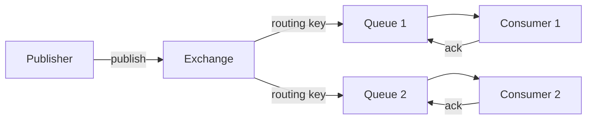
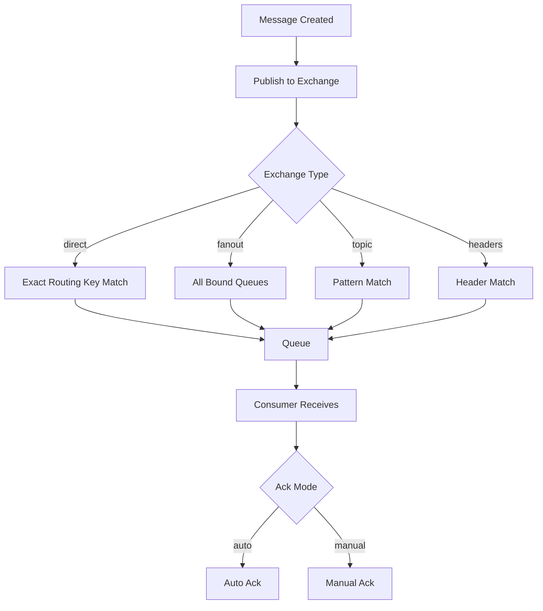

# Module 41: RabbitMQ

## 1. Introduction
RabbitMQ is an open-source message broker that implements the Advanced Message Queuing Protocol (AMQP). It provides reliable, scalable messaging between distributed systems using exchanges, queues, and bindings.

## 2. Learning Objectives
- Understand AMQP messaging concepts
- Configure exchanges, queues, and bindings
- Implement publisher and consumer patterns
- Use Spring AMQP for integration
- Handle message acknowledgment and reliability

## 3. Prerequisites
- Java 17+
- Spring Boot 3.x
- RabbitMQ server running
- Maven/Gradle

## 4. Why This Concept Exists
Distributed systems need reliable asynchronous communication. RabbitMQ decouples services, enabling fault tolerance, load balancing, and event-driven architectures.

## 5. Problem Statement
Services need to communicate without tight coupling, handle failures gracefully, and scale independently.

## 6. Theory
AMQP defines producers, consumers, exchanges, and queues. Producers send messages to exchanges. Exchanges route messages to queues based on bindings. Consumers read from queues.

## 7. Internal Working
1. Publisher connects to RabbitMQ
2. Message is published to an exchange with routing key
3. Exchange matches routing key to queue bindings
4. Message is enqueued in matched queue(s)
5. Consumer subscribes and receives messages
6. Acknowledgment sent back after processing

## 8. JVM Perspective
Spring AMQP uses RabbitMQ Java client under the hood. Connections are pooled. Channels are multiplexed. Listeners run in separate threads from the listener container.

## 9. Memory Representation
```
Connection (TCP)
├── Channel 1
│   ├── Exchange
│   │   ├── Queue A (binding: routing.key)
│   │   └── Queue B (binding: routing.*)
│   └── Publisher
└── Channel 2
    └── Consumer
```

## 10. Architecture Diagram


## 11. Flow Diagram


## 12. Syntax

```java
// Exchange Configuration
@Bean
public TopicExchange ordersExchange() {
    return ExchangeBuilder.topicExchange("orders.exchange").durable(true).build();
}

// Queue Configuration
@Bean
public Queue ordersQueue() {
    return QueueBuilder.durable("orders.queue")
        .withArgument("x-dead-letter-exchange", "dlx.exchange")
        .build();
}

// Binding
@Bean
public Binding ordersBinding(Queue ordersQueue, TopicExchange ordersExchange) {
    return BindingBuilder.bind(ordersQueue).to(ordersExchange).with("orders.*");
}

// Publisher
rabbitTemplate.convertAndSend("orders.exchange", "orders.created", message);

// Consumer
@RabbitListener(queues = "orders.queue")
public void handleMessage(OrderMessage message) {
    // Process message
}
```

## 13. Easy Example

```java
@SpringBootApplication
public class RabbitMqDemo {
    public static void main(String[] args) {
        SpringApplication.run(RabbitMqDemo.class, args);
    }
}

@Service
public class MessageProducer {
    @Autowired
    private RabbitTemplate rabbitTemplate;

    public void sendMessage(String message) {
        rabbitTemplate.convertAndSend("test.exchange", "test.key", message);
    }
}

@Service
public class MessageConsumer {
    @RabbitListener(queues = "test.queue")
    public void receiveMessage(String message) {
        System.out.println("Received: " + message);
    }
}
```

## 14. Medium Example

```java
@Configuration
public class RabbitConfig {
    @Bean
    public TopicExchange appExchange() {
        return ExchangeBuilder.topicExchange("app.exchange").durable(true).build();
    }

    @Bean
    public Queue emailQueue() {
        return QueueBuilder.durable("email.queue").build();
    }

    @Bean
    public Queue notificationQueue() {
        return QueueBuilder.durable("notification.queue").build();
    }

    @Bean
    public Binding emailBinding(Queue emailQueue, TopicExchange appExchange) {
        return BindingBuilder.bind(emailQueue).to(appExchange).with("email.*");
    }

    @Bean
    public Binding notificationBinding(Queue notificationQueue, TopicExchange appExchange) {
        return BindingBuilder.bind(notificationQueue).to(appExchange).with("notification.*");
    }
}

@Service
public class NotificationService {
    @RabbitListener(queues = "email.queue")
    public void handleEmail(EmailMessage msg) {
        sendEmail(msg.getTo(), msg.getBody());
    }

    @RabbitListener(queues = "notification.queue")
    public void handleNotification(NotificationMessage msg) {
        sendPush(msg.getUserId(), msg.getContent());
    }
}
```

## 15. Hard Example

```java
@Configuration
public class DeadLetterConfig {
    @Bean
    public DirectExchange dlxExchange() {
        return new DirectExchange("dlx.exchange");
    }

    @Bean
    public Queue dlqQueue() {
        return QueueBuilder.durable("dlq.queue").build();
    }

    @Bean
    public Binding dlqBinding() {
        return BindingBuilder.bind(dlqQueue()).to(dlxExchange()).with("dlq");
    }

    @Bean
    public Queue processingQueue() {
        return QueueBuilder.durable("processing.queue")
            .withArgument("x-dead-letter-exchange", "dlx.exchange")
            .withArgument("x-dead-letter-routing-key", "dlq")
            .withArgument("x-message-ttl", 60000)
            .build();
    }
}

@Service
@RabbitListener(queues = "processing.queue")
public class ReliableMessageProcessor {
    @RabbitHandler
    public void process(Message message, Channel channel,
                        @Header(AmqpHeaders.DELIVERY_TAG) long tag) throws IOException {
        try {
            processPayload(message);
            channel.basicAck(tag, false);
        } catch (TransientException e) {
            channel.basicNack(tag, false, true); // requeue
        } catch (Exception e) {
            channel.basicNack(tag, false, false); // send to DLQ
        }
    }
}
```

## 16. Enterprise Example

```java
@Service
public class OrderEventPublisher {
    @Autowired private RabbitTemplate rabbitTemplate;
    @Autowired private ObjectMapper objectMapper;

    public void publishOrderEvent(OrderEvent event) {
        Message message = MessageBuilder
            .withBody(objectMapper.writeValueAsBytes(event))
            .setContentType(MessageProperties.CONTENT_TYPE_JSON)
            .setHeader("event-type", event.getType())
            .setHeader("correlation-id", UUID.randomUUID().toString())
            .build();

        rabbitTemplate.send("order.exchange", "order." + event.getType(), message);
    }
}

@Service
public class OrderEventHandler {
    @RabbitListener(bindings = @QueueBinding(
        value = @Queue(value = "order.processing.queue", durable = "true"),
        exchange = @Exchange(value = "order.exchange", type = "topic"),
        key = "order.*"
    ))
    public void handleOrderEvent(OrderEvent event, Channel channel,
                                  @Header(AmqpHeaders.DELIVERY_TAG) long tag) {
        switch (event.getType()) {
            case "created" -> handleOrderCreated(event);
            case "paid" -> handleOrderPaid(event);
            case "shipped" -> handleOrderShipped(event);
        }
        channel.basicAck(tag, false);
    }
}
```

## 17. Performance
- **Connection Pooling**: Reuse connections across threads
- **Channel Pooling**: Multiplex channels on connections
- **Consumer Concurrency**: Use `concurrentConsumers` and `maxConsumers`
- **Prefetch Count**: Control how many unacked messages a consumer holds

## 18. Time & Space Complexity
| Operation | Time | Space |
|-----------|------|-------|
| Publish Message | O(1) | O(n) |
| Route to Queue | O(1) | O(1) |
| Consume Message | O(1) | O(1) |
| Dead Letter Processing | O(1) | O(n) |
| Queue Message Storage | O(1) | O(n) |

## 19. Thread Safety
- RabbitTemplate is thread-safe
- Channel instances are NOT thread-safe
- Use one channel per thread or ChannelListener
- Connection pooling handles thread safety automatically

## 20. Best Practices
- Use durable queues and exchanges for production
- Implement dead letter queues for failed messages
- Set appropriate TTL for message expiration
- Use publisher confirms for reliability
- Monitor queue depths and consumer lag

## 21. Common Mistakes
- Not setting durable queues (messages lost on restart)
- Missing message acknowledgment (messages redelivered forever)
- Using default exchange with wrong routing
- Not handling consumer exceptions
- Overlooking memory limits on queues

## 22. Pitfalls
- Message ordering not guaranteed with multiple consumers
- Large messages can cause memory issues
- Network partitions can cause split-brain
- Auto-ack mode can lose messages on consumer crash

## 23. Debugging Tips
- Check RabbitMQ Management UI for queue depths
- Use `rabbitmqctl list_queues` for CLI monitoring
- Enable `spring.rabbitmq.listener.simple.retry.enabled` for retry
- Log message headers for correlation tracking

## 24. Comparison Table

| Feature | RabbitMQ | Kafka | ActiveMQ |
|---------|----------|-------|----------|
| Protocol | AMQP | Custom | AMQP/STOMP |
| Model | Smart Broker | Dumb Broker | Smart Broker |
| Ordering | Per-queue | Per-partition | Per-queue |
| Throughput | Medium | High | Medium |
| Message Retention | Until consumed | Time-based | Until consumed |
| Consumer Type | Push | Pull | Push |

## 25. Decision Tree

```
Need message broker?
├── Yes → Need ordering?
│   ├── Yes → Kafka
│   └── No → Need complex routing?
│       ├── Yes → RabbitMQ
│       └── No → Consider ActiveMQ
└── No → Need event streaming?
    ├── Yes → Kafka
    └── No → Use REST/gRPC
```

## 26. Interview Questions

1. **What is the difference between direct and topic exchanges?**
   Direct uses exact routing key match; topic uses wildcard patterns (*, #).

2. **How does RabbitMQ handle message acknowledgment?**
   Auto-ack: acknowledged on receive. Manual-ack: consumer explicitly acks after processing.

3. **What is a dead letter queue?**
   Queue that receives messages that were rejected, expired, or exceeded max length.

4. **How do you ensure message ordering?**
   Use a single consumer per queue or partition by routing key.

5. **What is publisher confirm?**
   RabbitMQ confirms to publisher that message was received and persisted.

6. **Explain prefetch count.**
   Number of unacknowledged messages a consumer can hold. Controls flow.

7. **How does RabbitMQ differ from Kafka?**
   RabbitMQ is a smart broker with complex routing; Kafka is a dumb log with high throughput.

8. **What are message properties?**
   Metadata like content-type, correlation-id, reply-to, expiration, priority.

9. **How do you handle poison messages?**
   Use dead letter queues, retry limits, and message TTL.

10. **What is message redelivery?**
    Requeueing a message for later delivery, typically after consumer rejection.

11. **How to scale RabbitMQ consumers?**
    Add more consumers, increase concurrency, or use queue sharding.

12. **What is the difference between basicGet and basicConsume?**
    basicGet is polling; basicConsume is push-based subscription.

13. **How do you implement request-reply pattern?**
    Use reply-to queue and correlation-id in message properties.

14. **What is message priority?**
    Higher priority messages are consumed first (requires priority queue support).

15. **How do you monitor RabbitMQ?**
    Management UI, Prometheus metrics, rabbitmqctl, Shovel/Federation.

16. **What is quorum queue?**
    Replicated queue for HA and data safety, recommended for production.

## 27. Exercises

### Beginner
Set up RabbitMQ with Spring Boot. Create a simple producer-consumer pair with a direct exchange.

### Intermediate
Implement a topic exchange with multiple routing keys. Add dead letter queue handling and retry logic.

### Advanced
Build a reliable order processing system with publisher confirms, dead letter queues, and consumer acknowledgment patterns.

## 28. Summary
RabbitMQ provides reliable, flexible message brokering with complex routing capabilities. Spring AMQP simplifies integration. Key concepts include exchanges, queues, bindings, and acknowledgment patterns for production reliability.

## 29. References
- RabbitMQ Official Documentation
- Spring AMQP Reference
- AMQP 0-9-1 Specification
- RabbitMQ Tutorials
- CloudAMQP Knowledge Base
