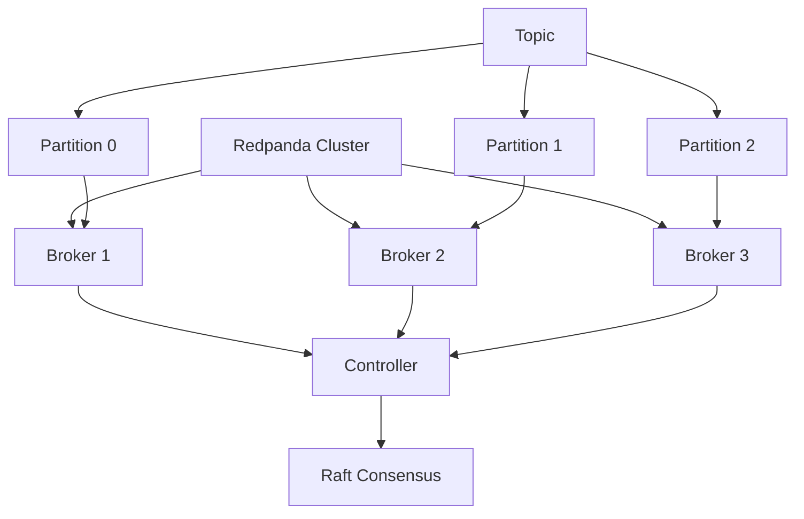
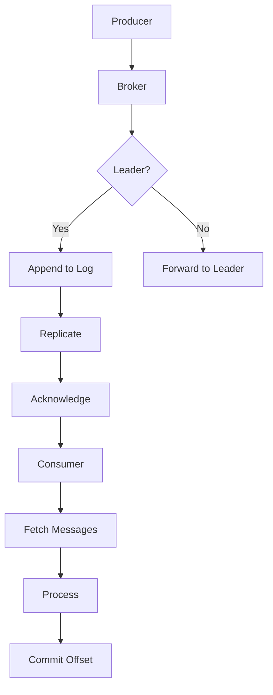
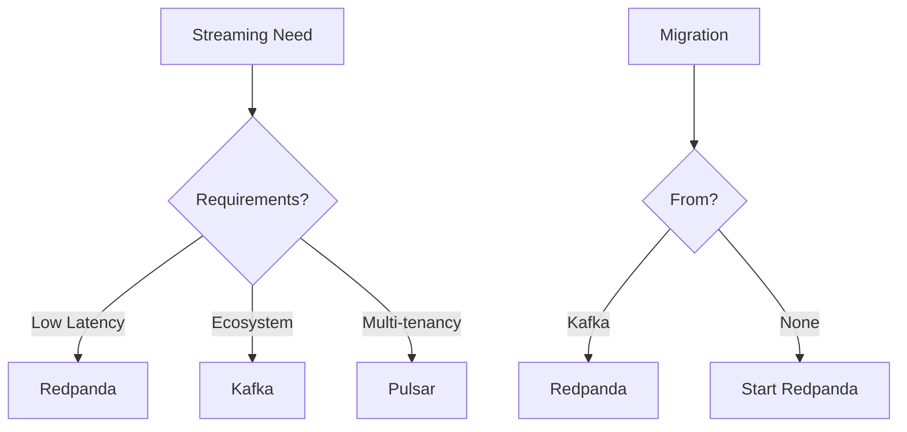

# Module 42: Redpanda

## Overview
Redpanda is a Kafka-compatible streaming data platform written in C++. It provides the same API as Apache Kafka but with simpler operations, lower latency, and better resource efficiency.

## Learning Objectives
- Understand Redpanda architecture
- Compare with Apache Kafka
- Use Redpanda Java client
- Implement streaming patterns
- Configure Redpanda clusters

## Prerequisites
- Apache Kafka basics
- Java networking
- Messaging concepts

## Why This Concept Exists
Apache Kafka has:
- Complex ZooKeeper dependency
- Java-based (GC pauses)
- High resource usage
- Complex configuration

Redpanda provides:
- No ZooKeeper (Raft consensus)
- C++ implementation (no GC)
- Lower latency
- Simpler operations

## Problem Statement
How do you use Redpanda as a Kafka-compatible streaming platform?

## Theory

### Redpanda vs Kafka

| Feature | Redpanda | Kafka |
|---------|----------|-------|
| Language | C++ | Java |
| Consensus | Raft | ZooKeeper/KRaft |
| Latency | <1ms | 1-10ms |
| Operations | Simple | Complex |
| Compatibility | Kafka API | Native |

### Architecture

| Component | Purpose |
|-----------|---------|
| Broker | Message handling |
| Controller | Cluster management |
| Partition | Data partitioning |
| Topic | Message organization |

## Internal Working

### Redpanda Internals
1. Raft consensus protocol
2. Zero-copy transfers
3. Thread-per-core model
4. Lock-free data structures

### Message Flow
1. Producer sends message
2. Broker receives message
3. Append to partition
4. Replicate to followers
5. Acknowledge producer
6. Consumer reads message

## JVM Perspective

### Client Libraries
- Java client (kafka-clients)
- rpk CLI tool
- Schema Registry
- REST Proxy

### Performance
- Lower latency than Kafka
- Higher throughput
- Better resource efficiency
- Simpler tuning

## Memory Representation
```
Redpanda Partition:
┌─────────────────────────────────────┐
│ Segment 1                           │
│  ├─ Messages                        │
│  ├─ Index                           │
│  └─ Time index                      │
├─────────────────────────────────────┤
│ Segment 2                           │
│  ├─ Messages                        │
│  └─ Index                           │
└─────────────────────────────────────┘
```

## Architecture Diagram



## Flow Diagram



## Syntax

### Java Client
```java
import org.apache.kafka.clients.producer.*;
import org.apache.kafka.clients.consumer.*;
import java.util.*;

// Producer
Properties props = new Properties();
props.put("bootstrap.servers", "localhost:9092");
props.put("key.serializer", "org.apache.kafka.common.serialization.StringSerializer");
props.put("value.serializer", "org.apache.kafka.common.serialization.StringSerializer");

KafkaProducer<String, String> producer = new KafkaProducer<>(props);
ProducerRecord<String, String> record = 
    new ProducerRecord<>("my-topic", "key", "value");
producer.send(record);

// Consumer
Properties consumerProps = new Properties();
consumerProps.put("bootstrap.servers", "localhost:9092");
consumerProps.put("group.id", "my-group");
consumerProps.put("key.deserializer", "org.apache.kafka.common.serialization.StringDeserializer");
consumerProps.put("value.deserializer", "org.apache.kafka.common.serialization.StringDeserializer");

KafkaConsumer<String, String> consumer = new KafkaConsumer<>(consumerProps);
consumer.subscribe(Arrays.asList("my-topic"));

while (true) {
    ConsumerRecords<String, String> records = consumer.poll(Duration.ofMillis(100));
    for (ConsumerRecord<String, String> record : records) {
        System.out.println(record.key() + ": " + record.value());
    }
}
```

## Easy Example
```java
import org.apache.kafka.clients.producer.*;
import java.util.*;

public class EasyExample {
    public static void main(String[] args) throws Exception {
        Properties props = new Properties();
        props.put("bootstrap.servers", "localhost:9092");
        props.put("key.serializer", "org.apache.kafka.common.serialization.StringSerializer");
        props.put("value.serializer", "org.apache.kafka.common.serialization.StringSerializer");
        
        try (KafkaProducer<String, String> producer = new KafkaProducer<>(props)) {
            for (int i = 0; i < 10; i++) {
                ProducerRecord<String, String> record = 
                    new ProducerRecord<>("test-topic", "key-" + i, "value-" + i);
                producer.send(record).get();
                System.out.println("Sent: " + i);
            }
        }
    }
}
```

## Medium Example
```java
import org.apache.kafka.clients.consumer.*;
import java.util.*;

public class MediumExample {
    public static void main(String[] args) {
        Properties props = new Properties();
        props.put("bootstrap.servers", "localhost:9092");
        props.put("group.id", "test-group");
        props.put("auto.offset.reset", "earliest");
        props.put("key.deserializer", "org.apache.kafka.common.serialization.StringDeserializer");
        props.put("value.deserializer", "org.apache.kafka.common.serialization.StringDeserializer");
        
        try (KafkaConsumer<String, String> consumer = new KafkaConsumer<>(props)) {
            consumer.subscribe(Arrays.asList("test-topic"));
            
            int consumed = 0;
            while (consumed < 10) {
                ConsumerRecords<String, String> records = consumer.poll(Duration.ofMillis(1000));
                for (ConsumerRecord<String, String> record : records) {
                    System.out.printf("Offset: %d, Key: %s, Value: %s%n",
                        record.offset(), record.key(), record.value());
                    consumed++;
                }
            }
        }
    }
}
```

## Hard Example
```java
import org.apache.kafka.clients.producer.*;
import org.apache.kafka.clients.consumer.*;
import java.util.concurrent.*;
import java.util.*;

public class HardExample {
    // Exactly-once semantics
    public static void main(String[] args) throws Exception {
        Properties producerProps = new Properties();
        producerProps.put("bootstrap.servers", "localhost:9092");
        producerProps.put("transactional.id", "my-transactional-id");
        producerProps.put("key.serializer", "org.apache.kafka.common.serialization.StringSerializer");
        producerProps.put("value.serializer", "org.apache.kafka.common.serialization.StringSerializer");
        
        KafkaProducer<String, String> producer = new KafkaProducer<>(producerProps);
        producer.initTransactions();
        
        Properties consumerProps = new Properties();
        consumerProps.put("bootstrap.servers", "localhost:9092");
        consumerProps.put("group.id", "my-group");
        consumerProps.put("isolation.level", "read_committed");
        consumerProps.put("key.deserializer", "org.apache.kafka.common.serialization.StringDeserializer");
        consumerProps.put("value.deserializer", "org.apache.kafka.common.serialization.StringDeserializer");
        
        KafkaConsumer<String, String> consumer = new KafkaConsumer<>(consumerProps);
        consumer.subscribe(Arrays.asList("input-topic"));
        
        producer.beginTransaction();
        try {
            ConsumerRecords<String, String> records = consumer.poll(Duration.ofMillis(1000));
            for (ConsumerRecord<String, String> record : records) {
                ProducerRecord<String, String> output = 
                    new ProducerRecord<>("output-topic", record.key(), record.value().toUpperCase());
                producer.send(output);
            }
            producer.commitTransaction();
        } catch (Exception e) {
            producer.abortTransaction();
        }
    }
}
```

## Enterprise Example
```java
import org.apache.kafka.clients.producer.*;
import org.apache.kafka.clients.consumer.*;
import org.apache.kafka.streams.*;
import java.util.*;

public class EnterpriseExample {
    // Kafka Streams with Redpanda
    public static void main(String[] args) {
        Properties props = new Properties();
        props.put(StreamsConfig.APPLICATION_ID_CONFIG, "my-stream-app");
        props.put(StreamsConfig.BOOTSTRAP_SERVERS_CONFIG, "localhost:9092");
        props.put(StreamsConfig.DEFAULT_KEY_SERDE_CLASS_CONFIG, 
            org.apache.kafka.common.serialization.Serdes.StringSerde.class);
        props.put(StreamsConfig.DEFAULT_VALUE_SERDE_CLASS_CONFIG, 
            org.apache.kafka.common.serialization.Serdes.StringSerde.class);
        
        StreamsBuilder builder = new StreamsBuilder();
        
        KStream<String, String> source = builder.stream("input-topic");
        
        source
            .filter((key, value) -> value != null)
            .mapValues(value -> value.toUpperCase())
            .to("output-topic");
        
        KafkaStreams streams = new KafkaStreams(builder.build(), props);
        streams.start();
        
        Runtime.getRuntime().addShutdownHook(new Thread(streams::close));
    }
}
```

## Performance Considerations
- Use batch sending
- Enable compression
- Configure appropriate replicas
- Use consumer groups

## Time & Space Complexity
| Operation | Time | Space |
|-----------|------|-------|
| Send | O(1) | O(batch) |
| Receive | O(1) | O(batch) |
| Replicate | O(n) | O(data) |
| Commit | O(1) | O(1) |

## Thread Safety
- Producer is thread-safe
- Consumer is not thread-safe
- Use separate threads per consumer
- KafkaStreams is thread-safe

## Best Practices
1. Use multiple partitions
2. Configure appropriate replicas
3. Use consumer groups
4. Enable compression
5. Monitor lag

## Common Mistakes
1. Not handling rebalances
2. Ignoring offset commits
3. Not using idempotent producer
4. Over-configuring

## Pitfalls & Warnings
1. Message ordering per partition
2. Consumer lag issues
3. Rebalance storms
4. Disk space management

## Debugging Tips
1. Use rpk topic consume
2. Check consumer lag
3. Monitor broker metrics
4. Use Kafka tools

## Comparison Table

| Feature | Redpanda | Kafka | Pulsar |
|---------|----------|-------|--------|
| Latency | <1ms | 1-10ms | 1-5ms |
| Operations | Simple | Complex | Complex |
| Compatibility | Kafka | Native | Partial |
| Language | C++ | Java | Java |

## Decision Tree



## Interview Questions

### Q1: What is Redpanda?
**Answer:** Kafka-compatible streaming platform written in C++.

### Q2: What is the difference between Redpanda and Kafka?
**Answer:** Redpanda is C++, no ZooKeeper, lower latency.

### Q3: How do you use Redpanda with Java?
**Answer:** Use standard Kafka Java client.

### Q4: What is Raft consensus?
**Answer:** Distributed consensus protocol replacing ZooKeeper.

### Q5: What is exactly-once semantics?
**Answer:** Guarantee each message is processed exactly once.

### Q6: What is consumer group?
**Answer:** Group of consumers sharing partition consumption.

### Q7: What is partitioning?
**Answer:** Dividing topic data across multiple brokers.

### Q8: What is replication?
**Answer:** Copying data across multiple brokers for fault tolerance.

### Q9: What is offset?
**Answer:** Position of consumer in partition.

### Q10: What is consumer lag?
**Answer:** Difference between latest and consumed offset.

### Q11: What is batch sending?
**Answer:** Sending multiple messages in one request.

### Q12: What is compression?
**Answer:** Reducing message size for efficiency.

### Q13: What is idempotent producer?
**Answer:** Producer that guarantees exactly-once delivery.

### Q14: What is transactional producer?
**Answer:** Producer that can send to multiple topics atomically.

### Q15: What is Kafka Streams?
**Answer:** Library for stream processing on Kafka topics.

## Exercises

### Easy
1. Send message to Redpanda
2. Consume messages from topic
3. Create producer and consumer

### Medium
1. Implement consumer group
2. Use transactions
3. Process streams with Kafka Streams

### Hard
1. Build event sourcing system
2. Implement exactly-once processing
3. Create streaming pipeline

## Summary
Redpanda provides Kafka-compatible streaming with better performance and simpler operations.

## References
- Redpanda Documentation
- Kafka Java Client
- Baeldung Kafka Guide
