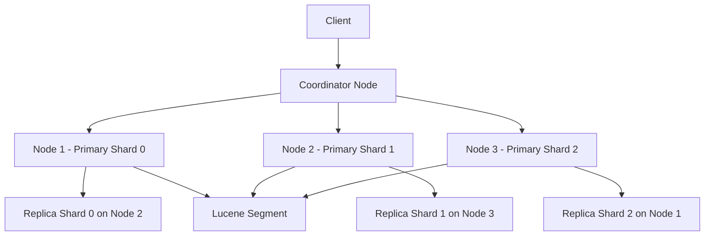
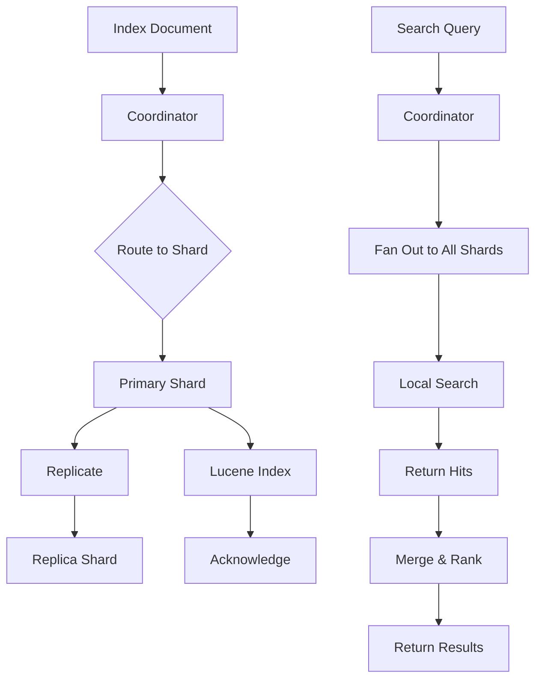

# Module 44: Elasticsearch

## Overview
Elasticsearch is a distributed search and analytics engine built on Apache Lucene. It provides full-text search, structured search, analytics, and near real-time performance for large-scale data.

## Learning Objectives
- Understand Elasticsearch architecture
- Use Java High-Level REST Client
- Implement search queries
- Handle indexing and mapping
- Configure clusters and shards

## Prerequisites
- REST API basics
- JSON knowledge
- Java HTTP client

## Why This Concept Exists
Databases struggle with full-text search, complex queries, and analytics. Elasticsearch provides distributed search, near real-time indexing, and powerful aggregations.

## Problem Statement
How do you implement fast, scalable full-text search and analytics?

## Theory

### Core Concepts

| Concept | Description |
|---------|-------------|
| Index | Collection of documents (like a table) |
| Document | JSON object (like a row) |
| Field | Property of document (like a column) |
| Shard | Partition of index for distribution |
| Replica | Copy of shard for fault tolerance |
| Cluster | Collection of nodes |
| Node | Single Elasticsearch instance |

### Mapping Types

| Type | Use Case |
|------|----------|
| text | Full-text searchable (analyzed) |
| keyword | Exact match, filtering, sorting |
| long/integer | Numeric values |
| date | Date values |
| boolean | True/false |
| nested | Arrays of objects |

### Query Types

| Query | Purpose |
|-------|---------|
| match | Full-text search |
| term | Exact match |
| range | Numeric/date range |
| bool | Boolean combinations |
| wildcard | Pattern matching |
| nested | Nested object queries |

## Internal Working

### Indexing Process
1. Document sent to node
2. Router determines shard
3. Document indexed in Lucene
4. Replicated to replica shards
5. Acknowledgment sent

### Search Process
1. Query sent to coordinator
2. Coordinator fans out to shards
3. Each shard searches locally
4. Results returned to coordinator
5. Coordinator merges and ranks
6. Final results returned

### Inverted Index
```
Document 1: "Java is popular"
Document 2: "Java Spring Boot"

Inverted Index:
  "java"    → [1, 2]
  "is"      → [1]
  "popular" → [1]
  "spring"  → [2]
  "boot"    → [2]
```

## JVM Perspective

### Java Client Options
- **Java API Client** (recommended, new)
- **High-Level REST Client** (deprecated in 8.x)
- **Low-Level REST Client** (manual HTTP)

### Memory Usage
- Heap: Index metadata, caches
- Off-heap: Lucene segments
- File system cache: Mapped buffers

## Architecture Diagram



## Flow Diagram



## Syntax

### Java API Client (Recommended)
```java
import co.elastic.clients.elasticsearch.*;
import co.elastic.clients.elasticsearch.core.*;
import co.elastic.clients.elasticsearch.core.search.*;
import co.elastic.clients.json.jackson.JacksonJsonpMapper;
import co.elastic.clients.transport.rest_client.RestClientTransport;
import org.apache.http.HttpHost;
import org.elasticsearch.client.RestClient;

// Create client
RestClient restClient = RestClient.builder(new HttpHost("localhost", 9200)).build();
RestClientTransport transport = new RestClientTransport(restClient, new JacksonJsonpMapper());
ElasticsearchClient client = new ElasticsearchClient(transport);

// Index document
client.index(i -> i
    .index("products")
    .id("1")
    .document(Map.of(
        "name", "Laptop",
        "price", 999.99,
        "category", "Electronics"
    ))
);

// Search
SearchResponse<Map> response = client.search(s -> s
    .index("products")
    .query(q -> q
        .match(m -> m
            .field("category")
            .query("Electronics")
        )
    )
    .size(10)
, Map.class);

for (Hit<Map> hit : response.hits().hits()) {
    System.out.println(hit.source());
}
```

### Legacy High-Level REST Client
```java
import org.elasticsearch.client.*;
import org.elasticsearch.action.index.*;
import org.elasticsearch.action.search.*;
import org.elasticsearch.index.query.*;
import org.elasticsearch.search.builder.*;

RestHighLevelClient client = new RestHighLevelClient(
    RestClient.builder(new HttpHost("localhost", 9200))
);

// Index
IndexRequest request = new IndexRequest("products")
    .id("1")
    .source(Map.of("name", "Laptop", "price", 999.99));
client.index(request, RequestOptions.DEFAULT);

// Search
SearchRequest searchRequest = new SearchRequest("products");
SearchSourceBuilder sourceBuilder = new SearchSourceBuilder();
sourceBuilder.query(QueryBuilders.matchQuery("name", "laptop"));
searchRequest.source(sourceBuilder);
SearchResponse response = client.search(searchRequest, RequestOptions.DEFAULT);
```

## Easy Example
```java
import co.elastic.clients.elasticsearch.*;
import co.elastic.clients.elasticsearch.core.*;
import org.apache.http.HttpHost;
import org.elasticsearch.client.RestClient;

public class ElasticsearchEasyExample {
    public static void main(String[] args) throws Exception {
        RestClient restClient = RestClient.builder(new HttpHost("localhost", 9200)).build();
        ElasticsearchClient client = new ElasticsearchClient(
            restClient, new co.elastic.clients.json.jackson.JacksonJsonpMapper());

        // Index a document
        client.index(i -> i
            .index("books")
            .id("1")
            .document(Map.of(
                "title", "Effective Java",
                "author", "Joshua Bloch",
                "year", 2018,
                "price", 45.99
            ))
        );
        System.out.println("Document indexed");

        // Search
        SearchResponse<Map> response = client.search(s -> s
            .index("books")
            .query(q -> q.match(m -> m.field("title").query("Effective")))
        , Map.class);

        System.out.println("Found: " + response.hits().total().count() + " hits");
        response.hits().hits().forEach(hit ->
            System.out.println("  " + hit.source())
        );
    }
}
```

## Medium Example
```java
import co.elastic.clients.elasticsearch.*;
import co.elastic.clients.elasticsearch.core.*;
import co.elastic.clients.elasticsearch.core.search.*;
import co.elastic.clients.elasticsearch.core.aggregations.*;
import co.elastic.clients.elasticsearch._types.query_dsl.*;
import org.apache.http.HttpHost;
import org.elasticsearch.client.RestClient;

public class ElasticsearchMediumExample {
    public static void main(String[] args) throws Exception {
        RestClient restClient = RestClient.builder(new HttpHost("localhost", 9200)).build();
        ElasticsearchClient client = new ElasticsearchClient(
            restClient, new co.elastic.clients.json.jackson.JacksonJsonpMapper());

        // Bulk index
        BulkRequest.Builder br = new BulkRequest.Builder();
        for (int i = 1; i <= 100; i++) {
            br.operations(op -> op
                .index(idx -> idx
                    .index("products")
                    .id(String.valueOf(i))
                    .document(Map.of(
                        "name", "Product " + i,
                        "price", Math.random() * 500,
                        "category", i % 2 == 0 ? "Electronics" : "Books",
                        "inStock", i % 3 != 0
                    ))
                )
            );
        }
        client.bulk(br.build());

        // Bool query with aggregations
        SearchResponse<Map> response = client.search(s -> s
            .index("products")
            .query(q -> q
                .bool(b -> b
                    .must(m -> m.match(mt -> mt.field("category").query("Electronics")))
                    .filter(f -> f.range(r -> r.number(t -> t.field("price").lte(250.0))))
                )
            )
            .aggregations("avg_price", a -> a.avg(avg -> avg.field("price")))
            .aggregations("categories", a -> a.terms(t -> t.field("category")))
            .size(10)
        , Map.class);

        System.out.println("Hits: " + response.hits().total().count());

        // Aggregation results
        var avgPrice = response.aggregations().get("avg_price").avg();
        System.out.println("Avg price: " + avgPrice.value());

        var categories = response.aggregations().get("categories").sterms();
        categories.buckets().forEach(b ->
            System.out.println("  " + b.key() + ": " + b.docCount())
        );
    }
}
```

## Hard Example
```java
import co.elastic.clients.elasticsearch.*;
import co.elastic.clients.elasticsearch.core.*;
import co.elastic.clients.elasticsearch.core.search.*;
import co.elastic.clients.elasticsearch.core.highlight.*;
import co.elastic.clients.elasticsearch.core.suggest.*;
import co.elastic.clients.json.jackson.JacksonJsonpMapper;
import org.apache.http.HttpHost;
import org.elasticsearch.client.RestClient;

public class ElasticsearchHardExample {
    public static void main(String[] args) throws Exception {
        RestClient restClient = RestClient.builder(new HttpHost("localhost", 9200)).build();
        ElasticsearchClient client = new ElasticsearchClient(
            restClient, new JacksonJsonpMapper());

        // Index articles
        client.bulk(b -> b
            .index("articles")
            .operations(op -> op
                .index(i -> i.document(Map.of("title", "Java Performance Tuning",
                    "content", "Learn how to optimize Java application performance")))
            )
            .operations(op -> op
                .index(i -> i.document(Map.of("title", "Spring Boot Guide",
                    "content", "Complete guide to building REST APIs with Spring Boot")))
            )
        );

        // Search with highlight and suggest
        SearchResponse<Map> response = client.search(s -> s
            .index("articles")
            .query(q -> q.match(m -> m.field("content").query("Java performance")))
            .highlight(h -> h
                .fields("content", f -> f
                    .preTags("<em>")
                    .postTags("</em>")
                    .fragmentSize(200)
                )
            )
            .suggest(su -> su
                .suggesters("title-suggest", sug -> sug
                    .completion(c -> c
                        .field("title")
                        .prefix("spr")
                        .size(5)
                    )
                )
            )
            .size(5)
        , Map.class);

        for (Hit<Map> hit : response.hits().hits()) {
            System.out.println("Source: " + hit.source());
            if (hit.highlight().containsKey("content")) {
                System.out.println("Highlight: " + hit.highlight().get("content"));
            }
        }
    }
}
```

## Enterprise Example
```java
import co.elastic.clients.elasticsearch.*;
import co.elastic.clients.elasticsearch.core.*;
import co.elastic.clients.elasticsearch.indices.*;
import co.elastic.clients.json.jackson.JacksonJsonpMapper;
import org.apache.http.HttpHost;
import org.elasticsearch.client.RestClient;
import java.time.Instant;
import java.util.concurrent.CompletableFuture;

public class ElasticsearchEnterpriseExample {
    public static void main(String[] args) throws Exception {
        RestClient restClient = RestClient.builder(new HttpHost("localhost", 9200)).build();
        ElasticsearchClient client = new ElasticsearchClient(
            restClient, new JacksonJsonpMapper());

        // Create index with mapping
        client.indices().create(c -> c
            .index("logs")
            .mappings(m -> m
                .properties("timestamp", p -> p.date(d -> d.format("strict_date_optional_time")))
                .properties("level", p -> p.keyword(k -> k))
                .properties("message", p -> p.text(t -> t.analyzer("standard")))
                .properties("service", p -> p.keyword(k -> k))
                .properties("responseTime", p -> p.double_(d -> d))
            )
            .settings(s -> s
                .numberOfShards("3")
                .numberOfReplicas("1")
            )
        );
        System.out.println("Index created");

        // Index log entries
        client.bulk(b -> b.index("logs")
            .operations(op -> op.index(i -> i.document(Map.of(
                "timestamp", Instant.now().toString(),
                "level", "ERROR",
                "message", "Connection timeout to database",
                "service", "payment-service",
                "responseTime", 5000.0
            ))))
            .operations(op -> op.index(i -> i.document(Map.of(
                "timestamp", Instant.now().toString(),
                "level", "INFO",
                "message", "Request processed successfully",
                "service", "api-gateway",
                "responseTime", 45.0
            ))))
        );

        // Search errors with slow response
        SearchResponse<Map> response = client.search(s -> s
            .index("logs")
            .query(q -> q.bool(b -> b
                .must(m -> m.term(t -> t.field("level").value("ERROR")))
                .filter(f -> f.range(r -> r.number(n -> n.field("responseTime").gt(1000.0))))
            ))
            .sort(so -> so.field(f -> f.field("timestamp").order(co.elastic.clients.elasticsearch._types.SortOrder.Desc)))
            .size(10)
        , Map.class);

        System.out.println("Slow errors found: " + response.hits().total().count());
    }
}
```

## Performance Considerations
- Use bulk API for batch indexing
- Set appropriate refresh interval
- Use routing for query performance
- Size shards appropriately (10-50GB)
- Use filter context for cached queries

## Time & Space Complexity

| Operation | Time | Space |
|-----------|------|-------|
| Index (single) | O(1) | O(doc size) |
| Bulk index | O(n) | O(batch size) |
| Exact match | O(log n) | O(1) |
| Full-text search | O(n) worst | O(results) |
| Aggregation | O(n) | O(buckets) |

## Thread Safety
- ElasticsearchClient is thread-safe
- RestClient is thread-safe
- Use bulk API for concurrent writes
- Avoid too many concurrent searches

## Best Practices
1. Use bulk API for indexing
2. Size shards to 10-50GB
3. Use filter context for caching
4. Set appropriate replicas
5. Monitor cluster health

## Common Mistakes
1. Too many small shards
2. Using text fields for filtering
3. Ignoring mapping analysis
4. Not using bulk API
5. Over-fetching data

## Comparison Table

| Feature | Elasticsearch | Solr | PostgreSQL FTS |
|---------|--------------|------|----------------|
| Full-text search | Excellent | Good | Basic |
| Analytics | Excellent | Limited | Limited |
| Scalability | Excellent | Good | Limited |
| Real-time | Near real-time | Near real-time | Real-time |

## Interview Questions

### Q1: What is Elasticsearch?
**Answer:** A distributed search and analytics engine built on Apache Lucene.

### Q2: What is an inverted index?
**Answer:** A data structure mapping terms to documents containing those terms.

### Q3: What is the difference between text and keyword fields?
**Answer:** Text fields are analyzed (tokenized), keyword fields are exact match.

### Q4: How does Elasticsearch achieve scalability?
**Answer:** Through sharding (partitioning) and replication.

### Q5: What is a coordinator node?
**Answer:** A node that receives search requests and fans them out to shards.

### Q6: What is refresh interval?
**Answer:** How often in-memory buffers are written to searchable segments (default 1s).

### Q7: What is the difference between query and filter context?
**Answer:** Query context scores results, filter context just filters (cacheable).

### Q8: How do you handle bulk indexing?
**Answer:** Use the Bulk API to send multiple documents in one request.

### Q9: What is a shard?
**Answer:** A partition of an index that holds a subset of documents.

### Q10: What are replicas?
**Answer:** Copies of shards for fault tolerance and read scaling.

### Q11: What is near real-time?
**Answer:** Data becomes searchable ~1 second after indexing (refresh interval).

### Q12: How do you optimize search performance?
**Answer:** Use filter context, appropriate mapping, and proper shard sizing.

### Q13: What is the difference between GET and SEARCH APIs?
**Answer:** GET retrieves by ID, SEARCH executes queries.

### Q14: What is document scoring?
**Answer:** Relevance ranking based on term frequency and inverse document frequency.

### Q15: How do you monitor Elasticsearch?
**Answer:** Use _cluster/health, _cat APIs, and monitoring tools.

## Exercises

### Easy
1. Index a document
2. Search by field
3. Use term query

### Medium
1. Create index with mapping
2. Bulk index documents
3. Use bool query

### Hard
1. Implement aggregations
2. Build search suggestions
3. Configure cluster sharding

## Summary
Elasticsearch provides distributed full-text search and analytics with near real-time performance.

## References
- Elasticsearch Documentation
- Java API Client Guide
- Elastic Co Blog
