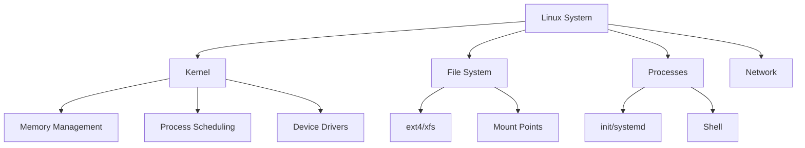
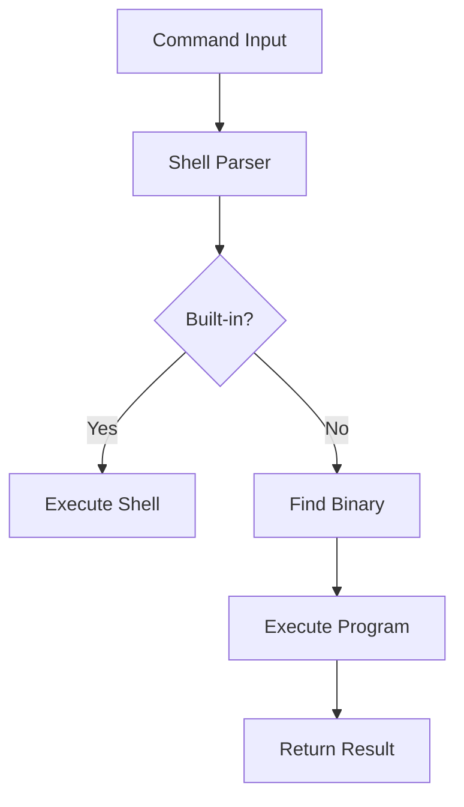

# Module 48: Linux for Java Developers

## Overview
Linux is the primary operating system for deploying Java applications. Understanding Linux commands, shell scripting, and system administration is essential for Java developers working with servers, containers, and cloud deployments.

## Learning Objectives
- Master essential Linux commands
- Write shell scripts
- Manage processes and services
- Handle file permissions
- Monitor system resources

## Prerequisites
- Basic command line knowledge
- File system concepts
- Java deployment experience

## Why This Concept Exists
Java applications run on Linux servers. Developers need to:
- Deploy and manage applications
- Debug production issues
- Automate tasks
- Monitor performance
- Handle security

## Problem Statement
How do you effectively work with Linux systems for Java development and deployment?

## Theory

### Essential Commands

| Category | Commands |
|----------|----------|
| Files | ls, cd, cp, mv, rm, mkdir |
| Text | cat, grep, sed, awk, head, tail |
| Process | ps, top, kill, bg, fg, nohup |
| Network | curl, netstat, ss, ping, ssh |
| Disk | df, du, mount, lsblk |
| Permissions | chmod, chown, chgrp |

### File Permissions

| Permission | Octal | Meaning |
|------------|-------|---------|
| rwx | 7 | Read, Write, Execute |
| rw- | 6 | Read, Write |
| r-x | 5 | Read, Execute |
| r-- | 4 | Read only |

## Internal Working

### Process Management
1. Process created (fork)
2. Program loaded (exec)
3. Signals handled
4. Resources managed
5. Process terminated

### File System Hierarchy
```
/
├── /etc        # Configuration
├── /var        # Variable data (logs)
├── /home       # User directories
├── /usr        # User programs
├── /tmp        # Temporary files
├── /opt        # Optional software
└── /proc       # Process information
```

## JVM Perspective

### Java on Linux
- JVM uses Linux threads (pthreads)
- /proc/self for JVM info
- Linux memory mapping
- File descriptor limits
- Signal handling

### Monitoring
- jps for Java processes
- jstat for GC monitoring
- jmap for heap dumps
- /proc/PID for process info

## Architecture Diagram



## Flow Diagram



## Syntax

### File Operations
```bash
# List files
ls -la                    # Long format, hidden files
ls -lh /var/log           # Human readable sizes

# Find files
find / -name "*.java" -type f
find . -mtime -7          # Modified in last 7 days

# Copy/Move
cp -r source/ dest/       # Recursive copy
mv file.txt newname.txt   # Rename/move
rm -rf directory/         # Force recursive delete
```

### Text Processing
```bash
# Search in files
grep -r "pattern" /path/
grep -i "error" logfile.txt | wc -l

# View files
tail -f /var/log/app.log  # Follow log
head -n 20 file.txt       # First 20 lines

# Edit with sed
sed -i 's/old/new/g' file.txt
sed -n '10,20p' file.txt  # Lines 10-20
```

### Process Management
```bash
# Find processes
ps aux | grep java
ps -ef | grep myapp

# Kill processes
kill PID                  # Graceful
kill -9 PID               # Force
pkill -f myapp            # By name

# Background processes
nohup java -jar app.jar &
disown %1                 # Detach from shell
```

### System Monitoring
```bash
# Disk usage
df -h                     # Filesystem usage
du -sh /var/log           # Directory size

# Memory
free -h                   # Memory usage
cat /proc/meminfo         # Detailed info

# CPU
top                       # Real-time
htop                      # Better top
uptime                    # Load average
```

### Shell Scripting
```bash
#!/bin/bash
# Variables
NAME="World"
echo "Hello, $NAME"

# Conditionals
if [ -f "file.txt" ]; then
    echo "File exists"
fi

# Loops
for i in {1..10}; do
    echo "Number: $i"
done

# Functions
deploy() {
    echo "Deploying $1..."
    mvn clean package
    java -jar target/app.jar
}
deploy "myapp"
```

## Easy Example
```bash
#!/bin/bash
# Simple deployment script

echo "Starting deployment..."

# Build
mvn clean package -DskipTests

# Stop old version
pkill -f "myapp.jar" || true

# Start new version
nohup java -jar target/myapp.jar > /var/log/myapp.log 2>&1 &

echo "Deployment complete. PID: $(pgrep -f myapp.jar)"
```

## Medium Example
```bash
#!/bin/bash
# Application health check script

APP_NAME="myapp"
LOG_FILE="/var/log/${APP_NAME}.log"
HEALTH_URL="http://localhost:8080/actuator/health"

# Check if process is running
check_process() {
    pgrep -f "${APP_NAME}.jar" > /dev/null
    return $?
}

# Check health endpoint
check_health() {
    response=$(curl -s -o /dev/null -w "%{http_code}" $HEALTH_URL)
    [ "$response" = "200" ]
}

# Monitor disk space
check_disk() {
    usage=$(df / | tail -1 | awk '{print $5}' | tr -d '%')
    [ "$usage" -lt 80 ]
}

# Main monitoring loop
while true; do
    if ! check_process; then
        echo "[$(date)] Process not running, restarting..."
        nohup java -jar /opt/${APP_NAME}/app.jar >> $LOG_FILE 2>&1 &
    fi
    
    if ! check_health; then
        echo "[$(date)] Health check failed"
    fi
    
    if ! check_disk; then
        echo "[$(date)] WARNING: Disk usage above 80%"
    fi
    
    sleep 60
done
```

## Hard Example
```bash
#!/bin/bash
# Log rotation and cleanup script

LOG_DIR="/var/log/java-apps"
KEEP_DAYS=30
COMPRESS_DAYS=7

# Rotate logs
rotate_logs() {
    find $LOG_DIR -name "*.log" -mtime +$COMPRESS_DAYS -exec gzip {} \;
    find $LOG_DIR -name "*.gz" -mtime +$KEEP_DAYS -delete
}

# JVM heap analysis
analyze_heap() {
    local pid=$1
    local dump_file="/tmp/heapdump_$(date +%Y%m%d).hprof"
    
    jmap -dump:live,format=b,file=$dump_file $pid
    echo "Heap dump saved to $dump_file"
    
    # Generate summary
    jhat $dump_file -port 7000 &
    echo "Heap analysis available at http://localhost:7000"
}

# Check for memory leaks
check_memory() {
    local pid=$1
    local threshold_mb=1024
    
    while true; do
        mem=$(jstat -gc $pid | awk '{print $6}' | tail -1)
        if [ "$mem" -gt "$threshold_mb" ]; then
            echo "[$(date)] High memory usage: ${mem}MB"
            analyze_heap $pid
        fi
        sleep 300
    done
}

# Deploy with rollback capability
deploy() {
    local app_name=$1
    local version=$2
    local backup_dir="/opt/backups/${app_name}"
    
    # Backup current version
    cp /opt/${app_name}/current.jar ${backup_dir}/$(date +%Y%m%d).jar
    
    # Deploy new version
    cp /opt/${app_name}/versions/${version}.jar /opt/${app_name}/current.jar
    
    # Restart
    systemctl restart ${app_name}
    
    echo "Deployed version ${version}"
}

rotate_logs
```

## Enterprise Example
```bash
#!/bin/bash
# Production monitoring and alerting

MONITOR_SCRIPT="/opt/scripts/monitor.sh"
ALERT_EMAIL="ops@company.com"
THRESHOLD_CPU=80
THRESHOLD_MEM=85
THRESHOLD_DISK=90

# Send alert
send_alert() {
    local subject=$1
    local message=$2
    echo "$message" | mail -s "$subject" $ALERT_EMAIL
}

# Monitor Java application
monitor_java_app() {
    local app_name=$1
    local pid=$(pgrep -f "${app_name}.jar")
    
    if [ -z "$pid" ]; then
        send_alert "ALERT: ${app_name} is DOWN" "Process not found"
        return 1
    fi
    
    # CPU usage
    cpu=$(top -bn1 -p $pid | tail -1 | awk '{print $9}')
    if (( $(echo "$cpu > $THRESHOLD_CPU" | bc -l) )); then
        send_alert "WARNING: ${app_name} CPU high" "CPU: ${cpu}%"
    fi
    
    # Memory usage
    mem=$(jstat -gc $pid | awk '{print $6}' | tail -1)
    if [ "$mem" -gt "$THRESHOLD_MEM" ]; then
        send_alert "WARNING: ${app_name} Memory high" "Heap: ${mem}MB"
    fi
    
    # Thread count
    threads=$(ls /proc/$pid/task | wc -l)
    if [ "$threads" -gt 500 ]; then
        send_alert "WARNING: ${app_name} Thread count high" "Threads: $threads"
    fi
    
    # GC stats
    jstat -gcutil $pid 1000 5
}

# System monitoring
monitor_system() {
    # CPU
    cpu=$(top -bn1 | grep "Cpu(s)" | awk '{print $2}')
    if (( $(echo "$cpu > $THRESHOLD_CPU" | bc -l) )); then
        send_alert "WARNING: System CPU high" "CPU: ${cpu}%"
    fi
    
    # Memory
    mem=$(free | grep Mem | awk '{print $3/$2 * 100.0}')
    if (( $(echo "$mem > $THRESHOLD_MEM" | bc -l) )); then
        send_alert "WARNING: System Memory high" "Memory: ${mem}%"
    fi
    
    # Disk
    disk=$(df / | tail -1 | awk '{print $5}' | tr -d '%')
    if [ "$disk" -gt "$THRESHOLD_DISK" ]; then
        send_alert "WARNING: Disk usage high" "Disk: ${disk}%"
    fi
}

# Main loop
while true; do
    monitor_java_app "payment-service"
    monitor_java_app "user-service"
    monitor_system
    sleep 60
done
```

## Performance Considerations
- Use nohup for long-running processes
- Limit file descriptors for Java
- Optimize JVM flags for Linux
- Use cgroups for resource limits

## Time & Space Complexity

| Command | Time | Description |
|---------|------|-------------|
| find | O(n) | File search |
| grep | O(n) | Text search |
| ps | O(p) | Process listing |
| du | O(n) | Directory size |

## Thread Safety
- Shell scripts are single-threaded
- Use & and wait for parallelism
- Use locks for shared resources
- Monitor zombie processes

## Best Practices
1. Use scripts for automation
2. Log output to files
3. Handle errors gracefully
4. Use exit codes properly
5. Document scripts

## Common Mistakes
1. Not quoting variables
2. Using rm -rf carelessly
3. Ignoring error output
4. Not checking return codes

## Comparison Table

| Tool | Purpose | Alternative |
|------|---------|-------------|
| grep | Text search | ripgrep, ack |
| find | File search | fd, locate |
| top | Process monitor | htop, glances |
| sed | Text edit | awk, perl |

## Interview Questions

### Q1: How do you find a Java process on Linux?
**Answer:** `ps aux | grep java` or `jps -l`

### Q2: How do you check heap usage?
**Answer:** `jstat -gc <pid>` or `jmap -heap <pid>`

### Q3: How do you take a heap dump?
**Answer:** `jmap -dump:live,format=b,file=dump.hprof <pid>`

### Q4: How do you restart a Java application?
**Answer:** `systemctl restart <service>` or `kill -HUP <pid>`

### Q5: How do you check file permissions?
**Answer:** `ls -la` to see permissions in octal/rwx format.

### Q6: How do you make a script executable?
**Answer:** `chmod +x script.sh`

### Q7: How do you run a process in background?
**Answer:** `nohup java -jar app.jar &` and `disown`

### Q8: How do you check disk space?
**Answer:** `df -h` for filesystem, `du -sh *` for directory sizes.

### Q9: How do you monitor logs in real-time?
**Answer:** `tail -f /var/log/app.log`

### Q10: How do you find files by name?
**Answer:** `find /path -name "*.java" -type f`

### Q11: How do you check memory usage?
**Answer:** `free -h` or `cat /proc/meminfo`

### Q12: How do you limit JVM memory?
**Answer:** `-Xms512m -Xmx2g` flags

### Q13: How do you check thread count?
**Answer:** `jstack <pid> | grep -c "^nid="` or `ls /proc/<pid>/task | wc -l`

### Q14: How do you check open file descriptors?
**Answer:** `ls /proc/<pid>/fd | wc -l` or `cat /proc/<pid>/limits`

### Q15: How do you check network connections?
**Answer:** `netstat -tlnp` or `ss -tlnp`

## Exercises

### Easy
1. Write a script to find Java files
2. Monitor a running application
3. Check disk usage

### Medium
1. Create a deployment script
2. Write a log rotation script
3. Monitor application health

### Hard
1. Build a monitoring dashboard
2. Create a CI/CD pipeline
3. Implement auto-scaling

## Summary
Linux proficiency is essential for Java developers deploying and managing applications in production.

## References
- Linux Command Line Tutorial
- JVM Troubleshooting Guide
- Linux Performance Analysis
