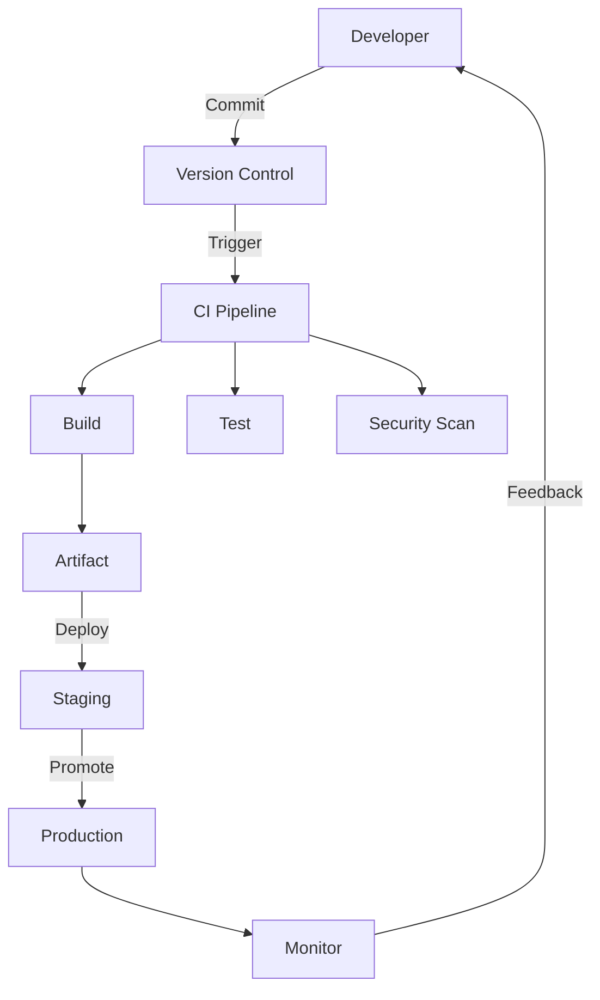
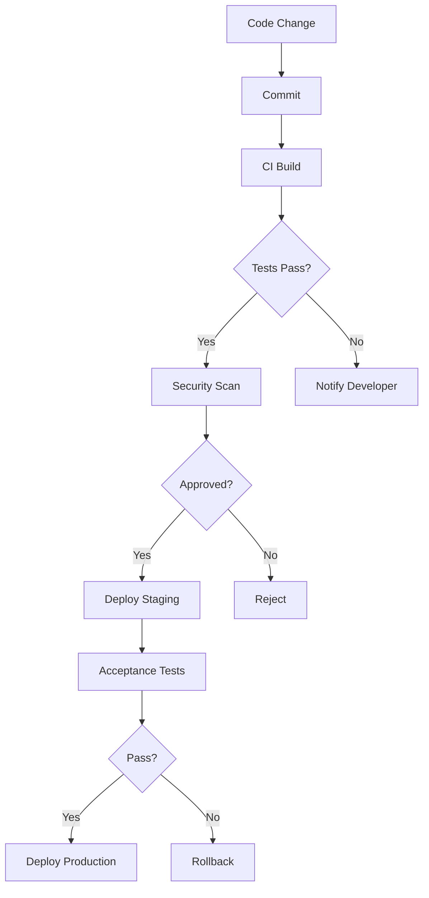

# Module 50: DevOps

## Overview
DevOps is a set of practices combining software development (Dev) and IT operations (Ops). It aims to shorten the development lifecycle and provide continuous delivery with high software quality.

## Learning Objectives
- Understand DevOps culture and principles
- Master CI/CD pipelines
- Implement infrastructure as code
- Use containerization and orchestration
- Apply monitoring and observability

## Prerequisites
- Linux basics
- Git knowledge
- Build tool experience

## Why This Concept Exists
Traditional development has:
- Long release cycles
- Manual deployments
- Siloed teams
- Blame culture

DevOps provides:
- Continuous delivery
- Automated deployments
- Shared responsibility
- Blameless culture

## Problem Statement
How do you deliver software faster and more reliably?

## Theory

### DevOps Principles

| Principle | Description |
|-----------|-------------|
| CI/CD | Continuous Integration/Delivery |
| IaC | Infrastructure as Code |
| Monitoring | Observability |
| Automation | Reduce manual work |
| Collaboration | Shared ownership |

### DevOps Tools

| Category | Tools |
|----------|-------|
| Version Control | Git, GitHub, GitLab |
| CI/CD | Jenkins, GitHub Actions, GitLab CI |
| Containers | Docker, Podman |
| Orchestration | Kubernetes, Docker Swarm |
| IaC | Terraform, Ansible |
| Monitoring | Prometheus, Grafana |

## Internal Working

### CI/CD Pipeline
1. Code commit
2. Build and compile
3. Unit tests
4. Integration tests
5. Security scan
6. Deploy to staging
7. Acceptance tests
8. Deploy to production
9. Monitor

### Infrastructure as Code
1. Define infrastructure in code
2. Version control
3. Review changes
4. Automated provisioning
5. Consistent environments

## JVM Perspective

### Java DevOps
- Maven/Gradle for builds
- JUnit/TestNG for testing
- Docker for containerization
- Kubernetes for orchestration
- Jenkins/GitHub Actions for CI/CD

### JVM Monitoring
- JMX for metrics
- Micrometer for instrumentation
- Prometheus for collection
- Grafana for visualization

## Architecture Diagram



## Flow Diagram



## Syntax

### GitHub Actions
```yaml
name: Java CI/CD

on:
  push:
    branches: [main]
  pull_request:
    branches: [main]

jobs:
  build:
    runs-on: ubuntu-latest
    
    steps:
    - uses: actions/checkout@v3
    
    - name: Set up JDK 21
      uses: actions/setup-java@v3
      with:
        java-version: '21'
        distribution: 'temurin'
    
    - name: Build with Maven
      run: mvn clean package
    
    - name: Run tests
      run: mvn test
    
    - name: Build Docker image
      run: docker build -t myapp:${{ github.sha }} .
    
    - name: Push to registry
      if: github.ref == 'refs/heads/main'
      run: |
        docker tag myapp:${{ github.sha }} registry/myapp:latest
        docker push registry/myapp:latest
```

### Dockerfile
```dockerfile
FROM eclipse-temurin:21-jdk as builder
WORKDIR /app
COPY pom.xml .
COPY src ./src
RUN mvn clean package -DskipTests

FROM eclipse-temurin:21-jre
WORKDIR /app
COPY --from=builder /app/target/*.jar app.jar
EXPOSE 8080
ENTRYPOINT ["java", "-jar", "app.jar"]
```

### Kubernetes Deployment
```yaml
apiVersion: apps/v1
kind: Deployment
metadata:
  name: myapp
spec:
  replicas: 3
  selector:
    matchLabels:
      app: myapp
  template:
    metadata:
      labels:
        app: myapp
    spec:
      containers:
      - name: myapp
        image: myapp:latest
        ports:
        - containerPort: 8080
        resources:
          requests:
            memory: "512Mi"
            cpu: "500m"
          limits:
            memory: "1Gi"
            cpu: "1000m"
```

## Easy Example
```yaml
# Simple GitHub Actions workflow
name: Build and Test

on: [push, pull_request]

jobs:
  build:
    runs-on: ubuntu-latest
    steps:
    - uses: actions/checkout@v3
    - uses: actions/setup-java@v3
      with:
        java-version: '21'
    - run: mvn clean test
    - run: mvn package
```

## Medium Example
```yaml
# Multi-stage pipeline
name: Production Pipeline

on:
  push:
    branches: [main]

jobs:
  test:
    runs-on: ubuntu-latest
    steps:
    - uses: actions/checkout@v3
    - uses: actions/setup-java@v3
      with:
        java-version: '21'
    - run: mvn verify
    
  security:
    needs: test
    runs-on: ubuntu-latest
    steps:
    - uses: actions/checkout@v3
    - name: Run Snyk security scan
      uses: snyk/actions/maven@master
    
  deploy:
    needs: security
    runs-on: ubuntu-latest
    if: github.ref == 'refs/heads/main'
    steps:
    - uses: actions/checkout@v3
    - name: Deploy to production
      run: ./deploy.sh
```

## Hard Example
```yaml
# Complete CI/CD with multiple environments
name: Full Pipeline

on:
  push:
    branches: [main, develop]

jobs:
  build:
    runs-on: ubuntu-latest
    outputs:
      version: ${{ steps.version.outputs.version }}
    steps:
    - uses: actions/checkout@v3
    - id: version
      run: echo "version=$(date +%Y%m%d)-${GITHUB_SHA::7}" >> $GITHUB_OUTPUT
    - run: mvn clean package -Dversion=${{ steps.version.outputs.version }}
    
  test:
    needs: build
    runs-on: ubuntu-latest
    services:
      postgres:
        image: postgres:15
        env:
          POSTGRES_DB: test
          POSTGRES_PASSWORD: test
    steps:
    - run: mvn verify -Dspring.profiles.active=test
    
  security:
    needs: build
    runs-on: ubuntu-latest
    steps:
    - run: mvn verify -Psecurity-scan
    
  deploy-staging:
    needs: [test, security]
    runs-on: ubuntu-latest
    if: github.ref == 'refs/heads/develop'
    environment: staging
    steps:
    - run: kubectl apply -f k8s/staging/
    
  deploy-production:
    needs: [test, security]
    runs-on: ubuntu-latest
    if: github.ref == 'refs/heads/main'
    environment: production
    steps:
    - run: kubectl apply -f k8s/production/
```

## Performance Considerations
- Cache Maven dependencies
- Parallel test execution
- Use Docker layer caching
- Optimize pipeline stages

## Time & Space Complexity

| Operation | Time | Resources |
|-----------|------|-----------|
| Build | 5-10 min | 1 CPU |
| Test | 10-30 min | 2 CPU |
| Deploy | 2-5 min | 1 CPU |
| Security scan | 5-15 min | 1 CPU |

## Thread Safety
- Pipeline stages are sequential
- Jobs can run in parallel
- Use artifacts for sharing
- Handle concurrent deployments

## Best Practices
1. Automate everything
2. Fail fast
3. Keep pipelines fast
4. Use infrastructure as code
5. Monitor everything

## Common Mistakes
1. Manual deployments
2. Skipping tests
3. Not monitoring
4. Blame culture
5. Long-lived branches

## Comparison Table

| Tool | Type | Complexity | Best For |
|------|------|------------|----------|
| Jenkins | CI/CD | High | Enterprise |
| GitHub Actions | CI/CD | Low | GitHub repos |
| GitLab CI | CI/CD | Medium | GitLab repos |
| CircleCI | CI/CD | Medium | Cloud |

## Interview Questions

### Q1: What is DevOps?
**Answer:** Culture and practices combining development and operations for faster delivery.

### Q2: What is CI/CD?
**Answer:** Continuous Integration (merge often) and Continuous Delivery (deploy often).

### Q3: What is Infrastructure as Code?
**Answer:** Managing infrastructure through code rather than manual processes.

### Q4: What is the difference between continuous delivery and deployment?
**Answer:** Delivery is manual approval, deployment is automatic.

### Q5: What is a pipeline?
**Answer:** Automated sequence of steps from code to production.

### Q6: What is Docker?
**Answer:** Containerization platform for packaging applications.

### Q7: What is Kubernetes?
**Answer:** Container orchestration platform for managing containers.

### Q8: What is monitoring?
**Answer:** Collecting and analyzing metrics, logs, and traces.

### Q9: What is observability?
**Answer:** Understanding system state from external outputs.

### Q10: What is a canary deployment?
**Answer:** Gradually rolling out changes to a subset of users.

### Q11: What is blue-green deployment?
**Answer:** Running two identical environments for zero-downtime deployment.

### Q12: What is rollback?
**Answer:** Reverting to a previous version when issues occur.

### Q13: What is infrastructure as code?
**Answer:** Defining infrastructure in version-controlled code files.

### Q14: What is configuration management?
**Answer:** Automating system configuration across environments.

### Q15: What is site reliability engineering?
**Answer:** Applying software engineering to operations problems.

## Exercises

### Easy
1. Set up GitHub Actions workflow
2. Create a Dockerfile
3. Write a simple CI pipeline

### Medium
1. Implement multi-stage pipeline
2. Set up Kubernetes deployment
3. Add monitoring to application

### Hard
1. Build complete DevOps platform
2. Implement infrastructure as code
3. Set up observability stack

## Summary
DevOps enables faster, more reliable software delivery through automation, collaboration, and continuous improvement.

## References
- DevOps Handbook
- The Phoenix Project
- SRE Book
