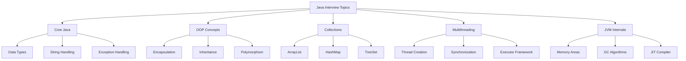
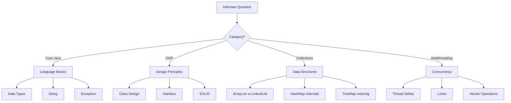

# Module 53: Java Interview Guide

## 1. Introduction

This module provides a comprehensive guide to Java interview preparation, covering core Java concepts, OOP principles, collections framework, multithreading, and JVM internals that are commonly asked in technical interviews.

## 2. Learning Objectives

- Master core Java interview questions and answers
- Understand OOP interview patterns
- Learn Collections framework questions
- Prepare for multithreading and concurrency questions
- Understand JVM internals and memory management

## 3. Prerequisites

- Solid understanding of Java basics
- Familiarity with OOP concepts
- Basic knowledge of collections
- Understanding of threading basics

## 4. Why This Concept Exists

Java interviews test not just coding ability but understanding of language fundamentals, design patterns, and system thinking. This guide helps candidates prepare systematically.

## 5. Problem Statement

Many Java developers struggle with interviews because they lack structured preparation for common questions and patterns.

## 6. Theory

### Core Java Topics
- Data types, operators, control flow
- String handling and immutability
- Exception handling hierarchy
- Generics and type erasure

### OOP Concepts
- Encapsulation, Inheritance, Polymorphism
- Abstract classes vs Interfaces
- SOLID principles
- Design patterns

## 7. Internal Working

### HashMap Internals
```java
// HashMap uses array of Node<K,V> with linked list/tree for collisions
Node<K,V>[] table;
// Hash computation
static final int hash(Object key) {
    int h;
    return (key == null) ? 0 : (h = key.hashCode()) ^ (h >>> 16);
}
```

### String Pool
```
String s1 = "Hello";  // Created in String Pool
String s2 = "Hello";  // References same object
String s3 = new String("Hello");  // Created in heap
```

## 8. JVM Perspective

### Memory Areas
- **Heap**: Object storage, GC managed
- **Stack**: Method frames, local variables
- **Method Area**: Class metadata, static variables
- **PC Register**: Current bytecode address

### JIT Compilation
- HotSpot detection
- Method inlining
- Escape analysis

## 9. Memory Representation

```
Stack Memory:
┌─────────────────────┐
│ main() frame        │
│  - args: String[]   │
│  - list: List       │
├─────────────────────┤
│ process() frame     │
│  - x: int           │
│  - temp: String     │
└─────────────────────┘

Heap Memory:
┌─────────────────────┐
│ Object Pool         │
│  - "Hello" (shared) │
│  - "World" (shared) │
├─────────────────────┤
│ New Objects         │
│  - new String()     │
│  - new ArrayList()  │
└─────────────────────┘
```

## 10. Architecture Diagram (Mermaid)



## 11. Flow Diagram (Mermaid)



## 12. Syntax

### Core Java
```java
// Immutability
public final class Immutable {
    private final int value;
    public Immutable(int value) { this.value = value; }
    public int getValue() { return value; }
}
```

### OOP
```java
// Interface vs Abstract Class
interface Drawable { void draw(); }
abstract class Shape { abstract double area(); }
```

### Collections
```java
// Thread-safe collections
ConcurrentHashMap<String, Integer> map = new ConcurrentHashMap<>();
CopyOnWriteArrayList<String> list = new CopyOnWriteArrayList<>();
```

## 13. Easy Example

```java
// Check if string is palindrome
public boolean isPalindrome(String str) {
    String reversed = new StringBuilder(str).reverse().toString();
    return str.equals(reversed);
}

// Find duplicate in array
public boolean hasDuplicate(int[] arr) {
    Set<Integer> set = new HashSet<>();
    for (int num : arr) {
        if (!set.add(num)) return true;
    }
    return false;
}
```

## 14. Medium Example

```java
// LRU Cache implementation
class LRUCache<K, V> extends LinkedHashMap<K, V> {
    private final int capacity;
    
    public LRUCache(int capacity) {
        super(capacity, 0.75f, true);
        this.capacity = capacity;
    }
    
    @Override
    protected boolean removeEldestEntry(Map.Entry<K, V> eldest) {
        return size() > capacity;
    }
}

// Producer-Consumer with BlockingQueue
BlockingQueue<String> queue = new LinkedBlockingQueue<>(10);

// Producer
new Thread(() -> {
    for (int i = 0; i < 100; i++) {
        queue.put("Item " + i);
    }
}).start();

// Consumer
new Thread(() -> {
    while (true) {
        String item = queue.take();
        process(item);
    }
}).start();
```

## 15. Hard Example

```java
// ConcurrentHashMap implementation sketch
class MyConcurrentHashMap<K, V> {
    private final AtomicReferenceArray<Node<K, V>> table;
    private final int capacity;
    
    static class Node<K, V> {
        final K key;
        volatile V value;
        volatile Node<K, V> next;
        
        Node(K key, V value, Node<K, V> next) {
            this.key = key;
            this.value = value;
            this.next = next;
        }
    }
    
    public V putIfAbsent(K key, V value) {
        int hash = hash(key);
        int index = hash % capacity;
        
        Node<K, V> head = table.get(index);
        Node<K, V> new_node = new Node<>(key, value, null);
        
        synchronized (head) {
            // CAS operation for thread safety
            // ... implementation
        }
        return null;
    }
}
```

## 16. Enterprise Example

```java
// Thread pool configuration for enterprise application
@Configuration
public class ThreadPoolConfig {
    
    @Bean("taskExecutor")
    public Executor taskExecutor() {
        ThreadPoolTaskExecutor executor = new ThreadPoolTaskExecutor();
        executor.setCorePoolSize(10);
        executor.setMaxPoolSize(50);
        executor.setQueueCapacity(100);
        executor.setThreadNamePrefix("async-");
        executor.setRejectedExecutionHandler(
            new ThreadPoolExecutor.CallerRunsPolicy()
        );
        executor.initialize();
        return executor;
    }
}

// Distributed lock implementation
@Component
public class DistributedLock {
    
    @Autowired
    private RedisTemplate<String, String> redisTemplate;
    
    public boolean tryLock(String key, long timeout) {
        return redisTemplate.opsForValue()
            .setIfAbsent(key, "locked", timeout, TimeUnit.SECONDS);
    }
}
```

## 17. Performance

| Operation | Time Complexity | Space Complexity |
|-----------|----------------|------------------|
| HashMap get | O(1) | O(n) |
| HashMap put | O(1) | O(n) |
| TreeMap get | O(log n) | O(n) |
| ArrayList get | O(1) | O(n) |
| LinkedList get | O(n) | O(n) |

## 18. Time & Space Complexity

### Common Algorithm Complexities
- **Bubble Sort**: O(n²) time, O(1) space
- **Merge Sort**: O(n log n) time, O(n) space
- **Binary Search**: O(log n) time, O(1) space
- **HashMap operations**: O(1) average

## 19. Thread Safety

```java
// Thread-safe singleton
public class Singleton {
    private static volatile Singleton instance;
    
    private Singleton() {}
    
    public static Singleton getInstance() {
        if (instance == null) {
            synchronized (Singleton.class) {
                if (instance == null) {
                    instance = new Singleton();
                }
            }
        }
        return instance;
    }
}

// Immutable class
public final class Money {
    private final BigDecimal amount;
    private final Currency currency;
    
    public Money(BigDecimal amount, Currency currency) {
        this.amount = amount;
        this.currency = currency;
    }
    
    public BigDecimal getAmount() { return amount; }
    public Currency getCurrency() { return currency; }
}
```

## 20. Best Practices

1. **String Comparisons**: Use `.equals()` not `==`
2. **Null Checks**: Use Optional or Objects.requireNonNull
3. **Collections**: Prefer interface types (List, Map, Set)
4. **Exceptions**: Don't catch generic Exception
5. **Resource Management**: Use try-with-resources
6. **Generics**: Avoid raw types
7. **Naming**: Follow Java naming conventions

## 21. Common Mistakes

```java
// Wrong: String comparison
if (str1 == str2) { } // References, not values

// Wrong: Modifying collection while iterating
for (String s : list) {
    if (s.equals("remove")) list.remove(s); // ConcurrentModificationException
}

// Wrong: Not closing resources
InputStream is = new FileInputStream("file.txt");
// Use try-with-resources instead

// Wrong: Catching generic exception
try { } catch (Exception e) { } // Too broad
```

## 22. Pitfalls

1. **== vs equals()**: Understanding reference equality
2. **hashCode() contract**: Must be consistent with equals()
3. **ConcurrentModificationException**: Iterator vs Collection modification
4. **Memory leaks**: Static references, inner classes
5. **Autoboxing**: Performance implications

## 23. Debugging Tips

1. **Use IntelliJ debugger**: Step through code
2. **Watch expressions**: Monitor variable values
3. **Memory profiler**: Find memory leaks
4. **Thread dump**: Analyze deadlocks
5. **JUnit tests**: Test edge cases

## 24. Comparison Table

| Feature | Abstract Class | Interface |
|---------|---------------|-----------|
| Multiple Inheritance | No | Yes |
| Constructor | Yes | No |
| Instance Variables | Yes | Only constants |
| Method Implementation | Yes | Default methods |
| Access Modifiers | Any | Public |

## 25. Decision Tree

```
Start
├── Need to implement multiple behaviors? → Interface
├── Need shared code? → Abstract Class
├── Need multiple inheritance? → Interface
├── Need constructors? → Abstract Class
└── Need state? → Abstract Class
```

## 26. Interview Questions (15+)

### Core Java
1. What is the difference between `==` and `.equals()`?
2. Why is String immutable in Java?
3. What is the difference between `final`, `finally`, and `finalize()`?
4. Explain the Singleton pattern with thread safety.

### OOP
5. What is the difference between abstraction and encapsulation?
6. Can we override static methods?
7. What is the diamond problem and how does Java solve it?

### Collections
8. What is the difference between ArrayList and LinkedList?
9. How does HashMap handle collisions?
10. What is the fail-fast vs fail-safe iterator?

### Multithreading
11. What is the difference between `wait()` and `sleep()`?
12. Explain the volatile keyword.
13. What is a deadlock and how to prevent it?

### JVM
14. What are the different memory areas in JVM?
15. Explain the GC process.
16. What is JIT compilation?

## 27. Exercises

### Beginner
1. Write a program to check if two strings are anagrams
2. Implement a simple Stack class
3. Find the frequency of characters in a string

### Intermediate
1. Implement a thread-safe LRU Cache
2. Create a custom Iterator for a linked list
3. Implement Producer-Consumer pattern

### Advanced
1. Design a concurrentHashMap from scratch
2. Implement a custom class loader
3. Create a thread pool with custom rejection policy

## 28. Summary

Java interviews test fundamental understanding of the language. Master core concepts, understand internals, and practice coding problems regularly.

## 29. References

- Effective Java by Joshua Bloch
- Java Concurrency in Practice
- Head First Java
- Cracking the Coding Interview
- Oracle Java Documentation
