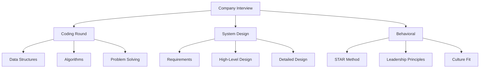
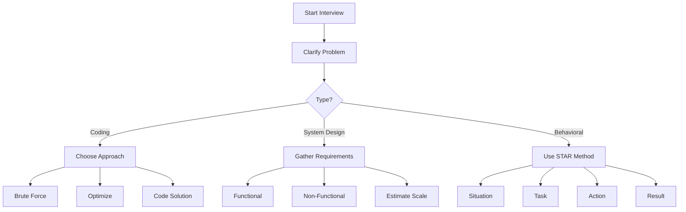

# Module 54: Company Interviews

## 1. Introduction

This module covers interview patterns and questions specific to major tech companies (FAANG and others), including system design, behavioral questions, and company-specific coding challenges.

## 2. Learning Objectives

- Understand FAANG interview patterns
- Learn company-specific question types
- Master system design interview approach
- Prepare for behavioral interviews using STAR method

## 3. Prerequisites

- Strong coding fundamentals
- Basic system design knowledge
- Problem-solving experience

## 4. Why This Concept Exists

Each tech company has unique interview styles and focuses. Understanding these patterns helps candidates prepare effectively.

## 5. Problem Statement

Generic interview preparation often misses company-specific requirements and patterns.

## 6. Theory

### FAANG Interview Process
1. **Phone Screen**: 45-60 min coding
2. **Onsite**: 4-6 rounds
   - Coding (2-3 rounds)
   - System Design (1-2 rounds)
   - Behavioral (1 round)

### Company Focus Areas
- **Google**: Algorithmic problem solving, coding
- **Amazon**: Leadership Principles, system design
- **Meta/Facebook**: Coding, system design
- **Apple**: Platform expertise, attention to detail
- **Netflix**: Culture fit, high-performer mindset

## 7. Internal Working

### System Design Interview Structure
```
1. Requirements Clarification (2-3 min)
   - Functional requirements
   - Non-functional requirements
   
2. High-Level Design (10-15 min)
   - Major components
   - API design
   - Data model
   
3. Detailed Design (15-20 min)
   - Component details
   - Algorithms
   - Scaling strategies
   
4. Wrap-up (2-3 min)
   - Bottlenecks
   - Monitoring
   - Future improvements
```

## 8. JVM Perspective

Not directly applicable - focuses on interview strategy rather than JVM internals.

## 9. Memory Representation

Interview Knowledge Structure:
```
Technical Skills
├── Coding Ability
│   ├── Data Structures
│   ├── Algorithms
│   └── Problem Solving
├── System Design
│   ├── Scalability
│   ├── Distributed Systems
│   └── Database Design
└── Behavioral
    ├── Leadership Principles
    ├── Conflict Resolution
    └── Team Collaboration
```

## 10. Architecture Diagram (Mermaid)



## 11. Flow Diagram (Mermaid)



## 12. Syntax

### STAR Method Template
```java
// S - Situation: Set the context
// T - Task: What was your responsibility
// A - Action: What you did
// R - Result: The outcome

// Example answer structure
String answer = """
    Situation: At Company X, we had a performance issue with our API...
    Task: As the lead developer, I was responsible for...
    Action: I identified the bottleneck was in database queries...
    Result: We reduced response time by 60%, improving user experience...
    """;
```

## 13. Easy Example

### Coding: Two Sum
```java
// Google-style: Clean, efficient solution
public int[] twoSum(int[] nums, int target) {
    Map<Integer, Integer> map = new HashMap<>();
    for (int i = 0; i < nums.length; i++) {
        int complement = target - nums[i];
        if (map.containsKey(complement)) {
            return new int[]{map.get(complement), i};
        }
        map.put(nums[i], i);
    }
    throw new IllegalArgumentException("No solution");
}
```

## 14. Medium Example

### System Design: URL Shortener
```java
// Key components
public class UrlShortener {
    private final Base62Encoder encoder;
    private final CacheService cache;
    private final DatabaseService db;
    
    public String shortenUrl(String longUrl) {
        String shortCode = encoder.encode(generateId());
        db.save(shortCode, longUrl);
        cache.put(shortCode, longUrl, TTL);
        return "https://short.url/" + shortCode;
    }
    
    public String expandUrl(String shortCode) {
        String cached = cache.get(shortCode);
        if (cached != null) return cached;
        
        String longUrl = db.findByCode(shortCode);
        cache.put(shortCode, longUrl, TTL);
        return longUrl;
    }
}
```

## 15. Hard Example

### System Design: Rate Limiter
```java
public class SlidingWindowRateLimiter {
    private final RedisTemplate<String, String> redis;
    private final int maxRequests;
    private final int windowSeconds;
    
    public boolean isAllowed(String userId) {
        long now = System.currentTimeMillis();
        long windowStart = now - (windowSeconds * 1000);
        
        String key = "rate:" + userId;
        
        // Remove old entries
        redis.opsForZSet().removeRangeByScore(key, 0, windowStart);
        
        // Count current window requests
        Long count = redis.opsForZSet().zCard(key);
        
        if (count < maxRequests) {
            // Add current request
            redis.opsForZSet().add(key, String.valueOf(now), now);
            redis.expire(key, windowSeconds);
            return true;
        }
        
        return false;
    }
}
```

## 16. Enterprise Example

### Amazon Leadership Principles Example
```java
/*
 * Leadership Principle: Customer Obsession
 * 
 * Situation: Customer complaints about slow checkout
 * Task: Reduce checkout time by 50%
 * Action: 
 *   - Analyzed checkout flow
 *   - Identified database bottleneck
 *   - Implemented caching layer
 *   - Added async payment processing
 * Result:
 *   - 70% reduction in checkout time
 *   - Customer satisfaction up 25%
 *   - Conversion rate improved 15%
 */
```

## 17. Performance

| Company | Coding Rounds | System Design | Behavioral |
|---------|--------------|---------------|------------|
| Google | 2-3 | 1 | 1 |
| Amazon | 2 | 1-2 | 1 |
| Meta | 2 | 1 | 1 |
| Apple | 2-3 | 1 | 1 |
| Netflix | 1-2 | 1 | 1 |

## 18. Time & Space Complexity

### Common Interview Algorithms
- **Two Pointers**: O(n) time, O(1) space
- **Sliding Window**: O(n) time, O(k) space
- **Binary Search**: O(log n) time, O(1) space
- **BFS/DFS**: O(V + E) time, O(V) space

## 19. Thread Safety

### Concurrent Data Structures
```java
// Thread-safe collections for interview solutions
ConcurrentHashMap<String, Integer> cache = new ConcurrentHashMap<>();
CopyOnWriteArrayList<String> list = new CopyOnWriteArrayList<>();
BlockingQueue<Task> queue = new LinkedBlockingQueue<>();
```

## 20. Best Practices

1. **Think aloud**: Show your thought process
2. **Clarify first**: Ask clarifying questions
3. **Start simple**: Begin with brute force
4. **Optimize**: Then improve complexity
5. **Test**: Walk through test cases
6. **Communicate**: Explain trade-offs

## 21. Common Mistakes

1. Jumping into coding without planning
2. Not asking clarifying questions
3. Ignoring edge cases
4. Not considering scalability
5. Poor time management

## 22. Pitfalls

1. Over-engineering solutions
2. Not handling errors gracefully
3. Ignoring interviewer hints
4. Being too rigid in approach
5. Not discussing trade-offs

## 23. Debugging Tips

1. **Code Review**: Ask interviewer to review
2. **Test Cases**: Walk through examples
3. **Edge Cases**: Consider empty/null inputs
4. **Complexity**: Verify your analysis

## 24. Comparison Table

| Aspect | Coding | System Design | Behavioral |
|--------|--------|---------------|------------|
| Duration | 45 min | 45-60 min | 30-45 min |
| Focus | Algorithms | Architecture | Leadership |
| Format | Write code | Draw diagrams | Tell stories |
| Skills | Problem solving | Trade-offs | Communication |

## 25. Decision Tree

```
Interview Question
├── Coding Problem?
│   ├── Array/String → Two pointers, Sliding window
│   ├── Linked List → Fast/slow pointers
│   ├── Tree/Graph → BFS/DFS
│   └── Dynamic Programming → Memoization
├── System Design?
│   ├── Read-heavy → Caching, CDN
│   ├── Write-heavy → Sharding, Queue
│   └── Real-time → WebSockets, Polling
└── Behavioral?
    ├── Conflict → STAR with resolution
    ├── Failure → STAR with learning
    └── Leadership → STAR with impact
```

## 26. Interview Questions (15+)

### Coding
1. How would you approach a problem you've never seen before?
2. What's your strategy for optimizing a solution?
3. How do you handle ambiguous requirements?

### System Design
4. How would you design a chat application?
5. Describe how you'd scale a system to millions of users
6. How would you handle data consistency in distributed systems?

### Behavioral
7. Tell me about a time you disagreed with a teammate
8. Describe a project you're most proud of
9. How do you handle competing priorities?

### Company-Specific
10. Amazon: Tell me about a time you went above and beyond
11. Google: Describe your most complex algorithm
12. Meta: How would you improve our product?

## 27. Exercises

### Beginner
1. Practice 2-3 coding problems daily
2. Review common data structures
3. Learn STAR method

### Intermediate
1. Complete 50 LeetCode problems
2. Practice 3 system designs
3. Prepare 10 behavioral stories

### Advanced
1. Mock interviews with peers
2. Solve medium-hard problems under time pressure
3. Design systems end-to-end

## 28. Summary

Company interviews test different skills. Tailor preparation to each company's focus areas while maintaining strong fundamentals.

## 29. References

- Cracking the Coding Interview
- Designing Data-Intensive Applications
- System Design Interview by Alex Xu
- Amazon Leadership Principles
- Google Interview Guide
