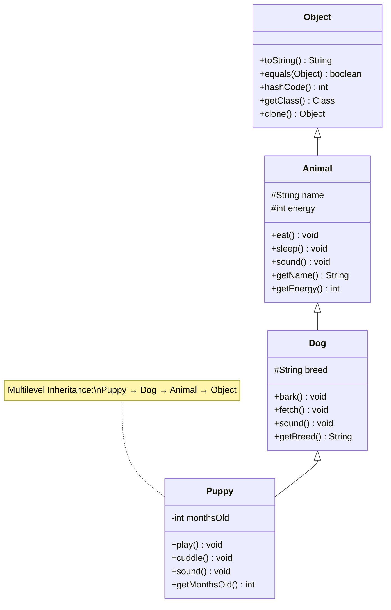
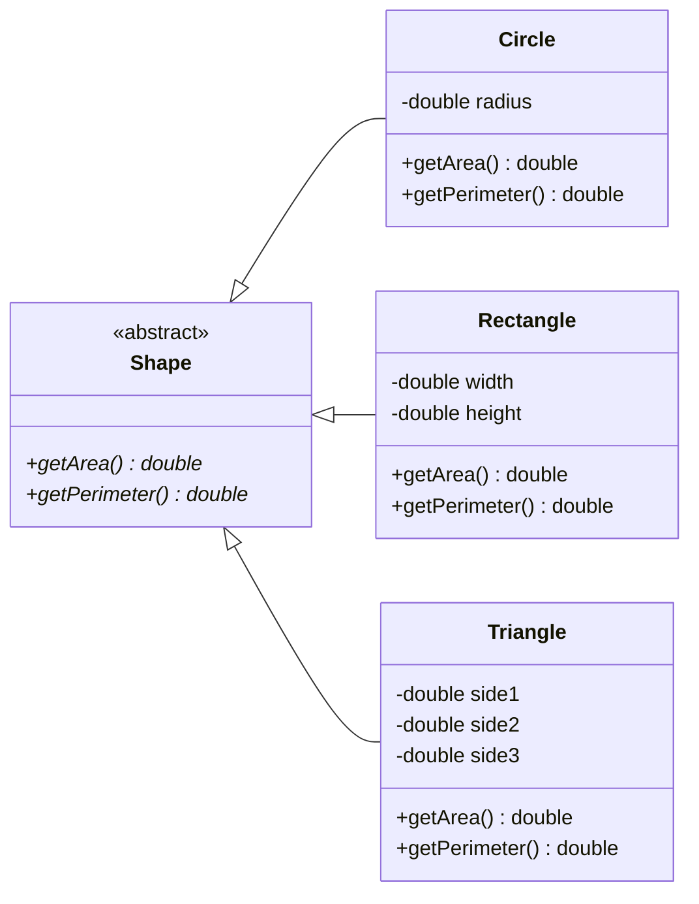
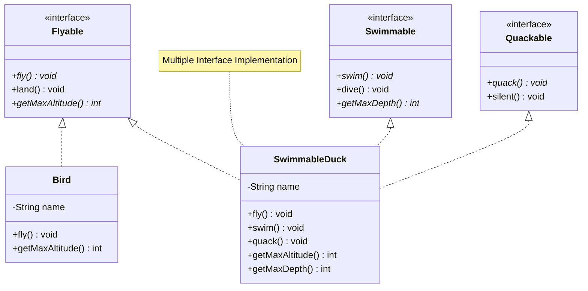
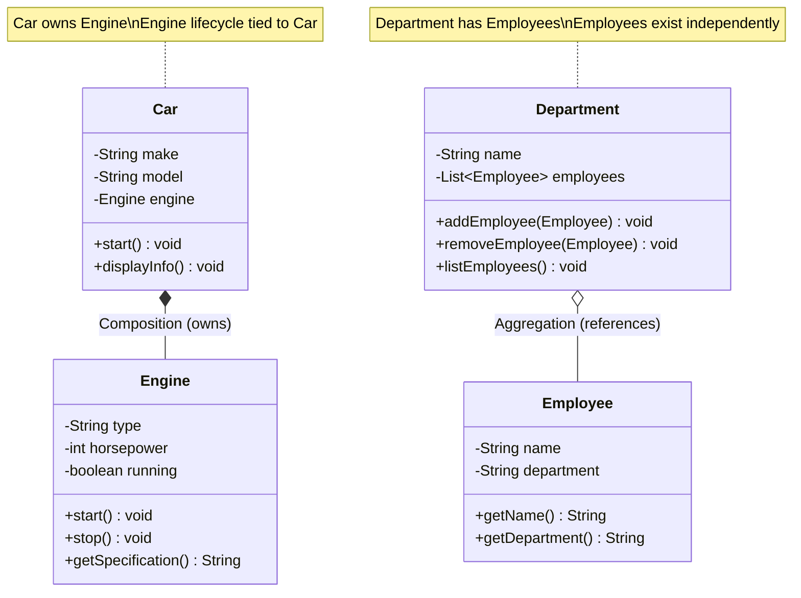
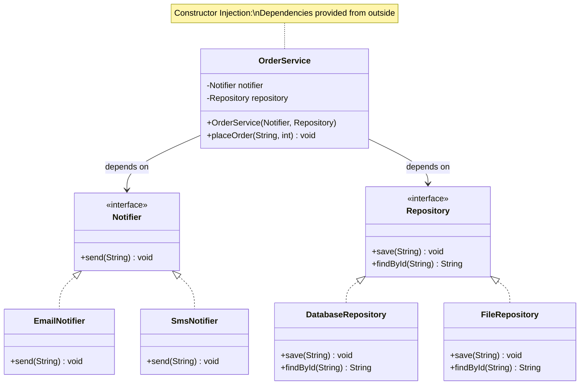
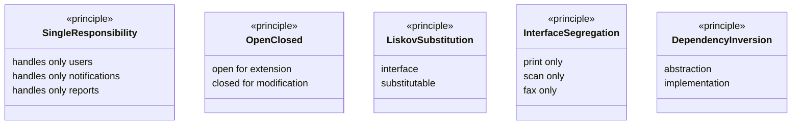

# Class Hierarchy Diagram

```mermaid
classDiagram
    direction TB
    
    class Object {
        +toString() String
        +equals(Object) boolean
        +hashCode() int
        +getClass() Class
        +clone() Object
    }
    
    class Animal {
        #String name
        #int energy
        +eat() void
        +sleep() void
        +sound() void
        +getName() String
        +getEnergy() int
    }
    
    class Dog {
        #String breed
        +bark() void
        +fetch() void
        +sound() void
        +getBreed() String
    }
    
    class Puppy {
        -int monthsOld
        +play() void
        +cuddle() void
        +sound() void
        +getMonthsOld() int
    }
    
    Object <|-- Animal
    Animal <|-- Dog
    Dog <|-- Puppy
    
    note for Puppy "Multilevel Inheritance:\nPuppy → Dog → Animal → Object"
```

## Inheritance Hierarchy

```mermaid
classDiagram
    direction LR
    
    class Shape {
        <<abstract>>
        +getArea()* double
        +getPerimeter()* double
    }
    
    class Circle {
        -double radius
        +getArea() double
        +getPerimeter() double
    }
    
    class Rectangle {
        -double width
        -double height
        +getArea() double
        +getPerimeter() double
    }
    
    class Triangle {
        -double side1
        -double side2
        -double side3
        +getArea() double
        +getPerimeter() double
    }
    
    Shape <|-- Circle
    Shape <|-- Rectangle
    Shape <|-- Triangle
```

## Interface Implementation

```mermaid
classDiagram
    direction TB
    
    class Flyable {
        <<interface>>
        +fly()* void
        +land() void
        +getMaxAltitude()* int
    }
    
    class Swimmable {
        <<interface>>
        +swim()* void
        +dive() void
        +getMaxDepth()* int
    }
    
    class Quackable {
        <<interface>>
        +quack()* void
        +silent() void
    }
    
    class Bird {
        -String name
        +fly() void
        +getMaxAltitude() int
    }
    
    class SwimmableDuck {
        -String name
        +fly() void
        +swim() void
        +quack() void
        +getMaxAltitude() int
        +getMaxDepth() int
    }
    
    Flyable <|.. Bird
    Flyable <|.. SwimmableDuck
    Swimmable <|.. SwimmableDuck
    Quackable <|.. SwimmableDuck
    
    note for SwimmableDuck "Multiple Interface Implementation"
```

## Composition vs Aggregation

```mermaid
classDiagram
    direction TB
    
    class Engine {
        -String type
        -int horsepower
        -boolean running
        +start() void
        +stop() void
        +getSpecification() String
    }
    
    class Car {
        -String make
        -String model
        -Engine engine
        +start() void
        +displayInfo() void
    }
    
    class Employee {
        -String name
        -String department
        +getName() String
        +getDepartment() String
    }
    
    class Department {
        -String name
        -List~Employee~ employees
        +addEmployee(Employee) void
        +removeEmployee(Employee) void
        +listEmployees() void
    }
    
    Car *-- Engine : Composition (owns)
    Department o-- Employee : Aggregation (references)
    
    note for Car "Car owns Engine\nEngine lifecycle tied to Car"
    note for Department "Department has Employees\nEmployees exist independently"
```

## Dependency Injection

```mermaid
classDiagram
    direction TB
    
    class Notifier {
        <<interface>>
        +send(String) void
    }
    
    class EmailNotifier {
        +send(String) void
    }
    
    class SmsNotifier {
        +send(String) void
    }
    
    class Repository {
        <<interface>>
        +save(String) void
        +findById(String) String
    }
    
    class DatabaseRepository {
        +save(String) void
        +findById(String) String
    }
    
    class FileRepository {
        +save(String) void
        +findById(String) String
    }
    
    class OrderService {
        -Notifier notifier
        -Repository repository
        +OrderService(Notifier, Repository)
        +placeOrder(String, int) void
    }
    
    Notifier <|.. EmailNotifier
    Notifier <|.. SmsNotifier
    Repository <|.. DatabaseRepository
    Repository <|.. FileRepository
    OrderService --> Notifier : depends on
    OrderService --> Repository : depends on
    
    note for OrderService "Constructor Injection:\nDependencies provided from outside"
```

## SOLID Principles

```mermaid
classDiagram
    direction TB
    
    class SingleResponsibility {
        <<principle>>
        handles only users
        handles only notifications
        handles only reports
    }
    
    class OpenClosed {
        <<principle>>
        open for extension
        closed for modification
    }
    
    class LiskovSubstitution {
        <<principle>>
        interface
        substitutable
    }
    
    class InterfaceSegregation {
        <<principle>>
        print only
        scan only
        fax only
    }
    
    class DependencyInversion {
        <<principle>>
        abstraction
        implementation
    }
```