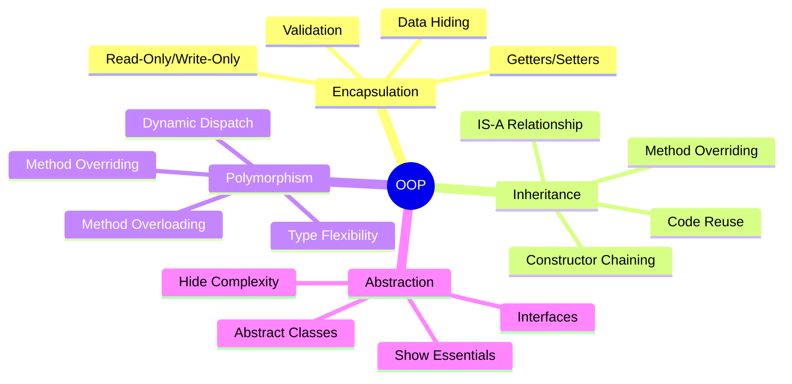
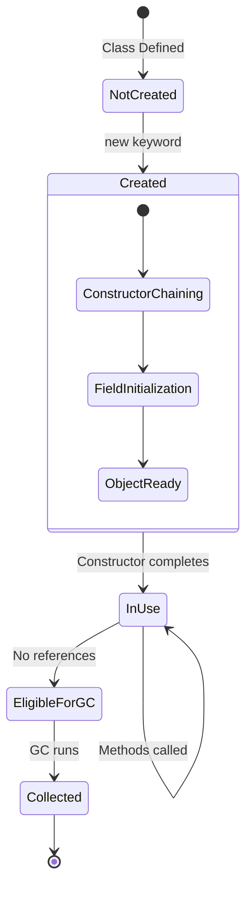
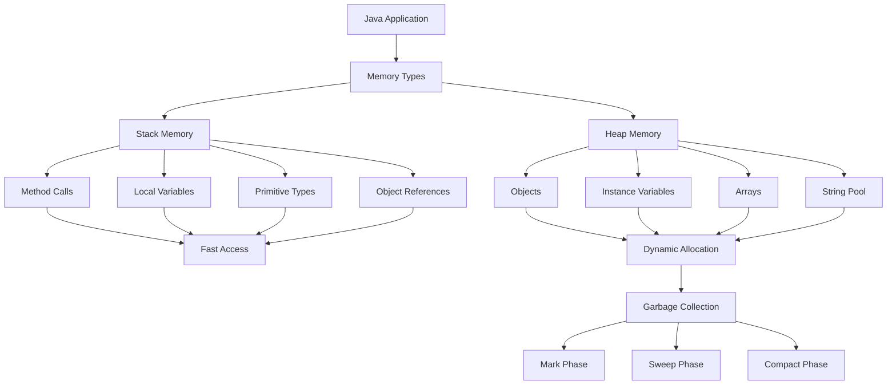
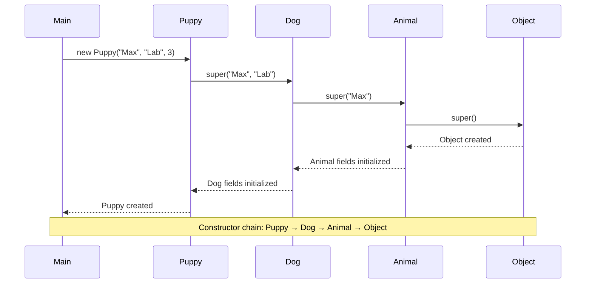
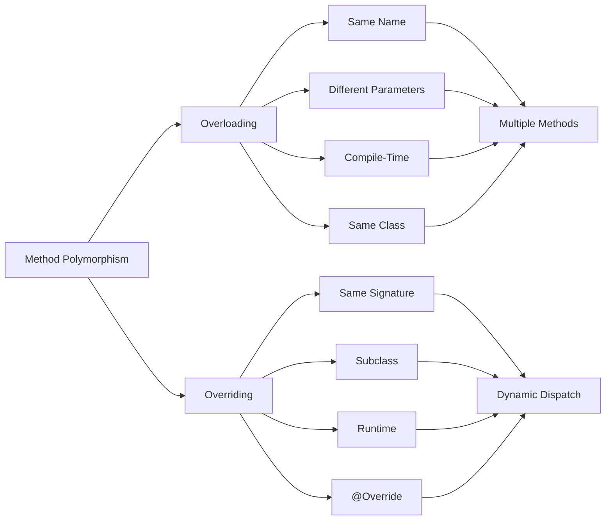
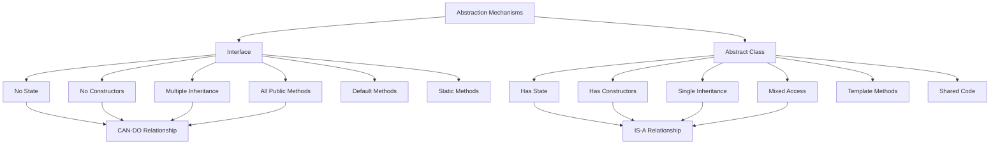
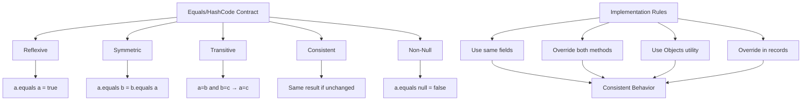

# OOP Concepts Diagrams

## Four Pillars of OOP

## Object Lifecycle

## Memory Allocation

## Constructor Chaining

## Method Overloading vs Overriding

## Interface vs Abstract Class

## Equals/HashCode Contract

